### Question 1

An upstream system has been configured to pass the date for a given batch of data to the Databricks Jobs API as a parameter. The notebook to be scheduled will use this parameter to load data with the following code: df = spark.read.format("parquet").load(f"/mnt/source/(date)")Which code block should be used to create the date Python variable used in the above code block?

- A.date = spark.conf.get("date")
- B.input_dict = input()date= input_dict["date"]
- C.import sysdate = sys.argv[1]
- D.date = dbutils.notebooks.getParam("date")
- E.dbutils.widgets.text("date", "null")date = dbutils.widgets.get("date")

---

### Question 2

The Databricks workspace administrator has configured interactive clusters for each of the data engineering groups. To control costs, clusters are set to terminate after 30 minutes of inactivity. Each user should be able to execute workloads against their assigned clusters at any time of the day.Assuming users have been added to a workspace but not granted any permissions, which of the following describes the minimal permissions a user would need to start and attach to an already configured cluster.

- A."Can Manage" privileges on the required cluster
- B.Workspace Admin privileges, cluster creation allowed, "Can Attach To" privileges on the required cluster
- C.Cluster creation allowed, "Can Attach To" privileges on the required cluster
- D."Can Restart" privileges on the required cluster
- E.Cluster creation allowed, "Can Restart" privileges on the required cluster

---

### Question 3

When scheduling Structured Streaming jobs for production, which configuration automatically recovers from query failures and keeps costs low?

- A.Cluster: New Job Cluster;Retries: Unlimited;Maximum Concurrent Runs: Unlimited
- B.Cluster: New Job Cluster;Retries: None;Maximum Concurrent Runs: 1
- C.Cluster: Existing All-Purpose Cluster;Retries: Unlimited;Maximum Concurrent Runs: 1
- D.Cluster: New Job Cluster;Retries: Unlimited;Maximum Concurrent Runs: 1
- E.Cluster: Existing All-Purpose Cluster;Retries: None;Maximum Concurrent Runs: 1

---

### Question 4

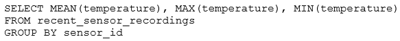

The data engineering team has configured a Databricks SQL query and alert to monitor the values in a Delta Lake table. The recent_sensor_recordings table contains an identifying sensor_id alongside the timestamp and temperature for the most recent 5 minutes of recordings.The below query is used to create the alert:The query is set to refresh each minute and always completes in less than 10 seconds. The alert is set to trigger when mean (temperature) > 120. Notifications are triggered to be sent at most every 1 minute.If this alert raises notifications for 3 consecutive minutes and then stops, which statement must be true?

- A.The total average temperature across all sensors exceeded 120 on three consecutive executions of the query
- B.The recent_sensor_recordings table was unresponsive for three consecutive runs of the query
- C.The source query failed to update properly for three consecutive minutes and then restarted
- D.The maximum temperature recording for at least one sensor exceeded 120 on three consecutive executions of the query
- E.The average temperature recordings for at least one sensor exceeded 120 on three consecutive executions of the query

---

### Question 5

A junior developer complains that the code in their notebook isn't producing the correct results in the development environment. A shared screenshot reveals that while they're using a notebook versioned with Databricks Repos, they're using a personal branch that contains old logic. The desired branch named dev-2.3.9 is not available from the branch selection dropdown.Which approach will allow this developer to review the current logic for this notebook?

- A.Use Repos to make a pull request use the Databricks REST API to update the current branch to dev-2.3.9
- B.Use Repos to pull changes from the remote Git repository and select the dev-2.3.9 branch.
- C.Use Repos to checkout the dev-2.3.9 branch and auto-resolve conflicts with the current branch
- D.Merge all changes back to the main branch in the remote Git repository and clone the repo again
- E.Use Repos to merge the current branch and the dev-2.3.9 branch, then make a pull request to sync with the remote repository

---

### Question 6

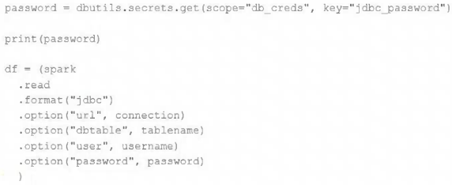

The security team is exploring whether or not the Databricks secrets module can be leveraged for connecting to an external database.After testing the code with all Python variables being defined with strings, they upload the password to the secrets module and configure the correct permissions for the currently active user. They then modify their code to the following (leaving all other variables unchanged).Which statement describes what will happen when the above code is executed?

- A.The connection to the external table will fail; the string "REDACTED" will be printed.
- B.An interactive input box will appear in the notebook; if the right password is provided, the connection will succeed and the encoded password will be saved to DBFS.
- C.An interactive input box will appear in the notebook; if the right password is provided, the connection will succeed and the password will be printed in plain text.
- D.The connection to the external table will succeed; the string value of password will be printed in plain text.
- E.The connection to the external table will succeed; the string "REDACTED" will be printed.

---

### Question 7

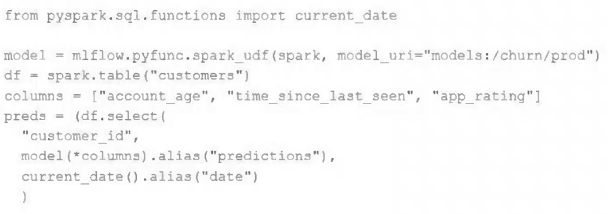

The data science team has created and logged a production model using MLflow. The following code correctly imports and applies the production model to output the predictions as a new DataFrame named preds with the schema "customer_id LONG, predictions DOUBLE, date DATE".The data science team would like predictions saved to a Delta Lake table with the ability to compare all predictions across time. Churn predictions will be made at most once per day.Which code block accomplishes this task while minimizing potential compute costs?

- A.preds.write.mode("append").saveAsTable("churn_preds")
- B.preds.write.format("delta").save("/preds/churn_preds")
- C.
- D.
- E.
- 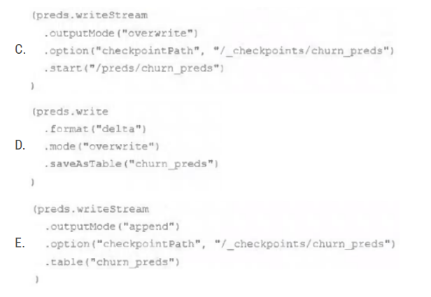

---

### Question 8

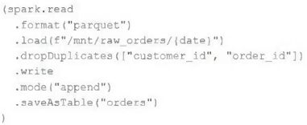

An upstream source writes Parquet data as hourly batches to directories named with the current date. A nightly batch job runs the following code to ingest all data from the previous day as indicated by the date variable:Assume that the fields customer_id and order_id serve as a composite key to uniquely identify each order.If the upstream system is known to occasionally produce duplicate entries for a single order hours apart, which statement is correct?

- A.Each write to the orders table will only contain unique records, and only those records without duplicates in the target table will be written.
- B.Each write to the orders table will only contain unique records, but newly written records may have duplicates already present in the target table.
- C.Each write to the orders table will only contain unique records; if existing records with the same key are present in the target table, these records will be overwritten.
- D.Each write to the orders table will only contain unique records; if existing records with the same key are present in the target table, the operation will fail.
- E.Each write to the orders table will run deduplication over the union of new and existing records, ensuring no duplicate records are present.

---

### Question 9

A junior member of the data engineering team is exploring the language interoperability of Databricks notebooks. The intended outcome of the below code is to register a view of all sales that occurred in countries on the continent of Africa that appear in the geo_lookup table.Before executing the code, running SHOW TABLES on the current database indicates the database contains only two tables: geo_lookup and sales.Which statement correctly describes the outcome of executing these command cells in order in an interactive notebook?

- A.Both commands will succeed. Executing show tables will show that countries_af and sales_af have been registered as views.
- B.Cmd 1 will succeed. Cmd 2 will search all accessible databases for a table or view named countries_af: if this entity exists, Cmd 2 will succeed.
- C.Cmd 1 will succeed and Cmd 2 will fail. countries_af will be a Python variable representing a PySpark DataFrame.
- D.Both commands will fail. No new variables, tables, or views will be created.
- E.Cmd 1 will succeed and Cmd 2 will fail. countries_af will be a Python variable containing a list of strings.

---

### Question 10

A Delta table of weather records is partitioned by date and has the below schema: date DATE, device_id INT, temp FLOAT, latitude FLOAT, longitude FLOATTo find all the records from within the Arctic Circle, you execute a query with the below filter: latitude > 66.3Which statement describes how the Delta engine identifies which files to load?

- A.All records are cached to an operational database and then the filter is applied
- B.The Parquet file footers are scanned for min and max statistics for the latitude column
- C.All records are cached to attached storage and then the filter is applied
- D.The Delta log is scanned for min and max statistics for the latitude column
- E.The Hive metastore is scanned for min and max statistics for the latitude column

---

### Question 11

The data engineering team has configured a job to process customer requests to be forgotten (have their data deleted). All user data that needs to be deleted is stored in Delta Lake tables using default table settings.The team has decided to process all deletions from the previous week as a batch job at 1am each Sunday. The total duration of this job is less than one hour. Every Monday at 3am, a batch job executes a series of VACUUM commands on all Delta Lake tables throughout the organization.The compliance officer has recently learned about Delta Lake's time travel functionality. They are concerned that this might allow continued access to deleted data.Assuming all delete logic is correctly implemented, which statement correctly addresses this concern?

- A.Because the VACUUM command permanently deletes all files containing deleted records, deleted records may be accessible with time travel for around 24 hours.
- B.Because the default data retention threshold is 24 hours, data files containing deleted records will be retained until the VACUUM job is run the following day.
- C.Because Delta Lake time travel provides full access to the entire history of a table, deleted records can always be recreated by users with full admin privileges.
- D.Because Delta Lake's delete statements have ACID guarantees, deleted records will be permanently purged from all storage systems as soon as a delete job completes.
- E.Because the default data retention threshold is 7 days, data files containing deleted records will be retained until the VACUUM job is run 8 days later.

---

### Question 12

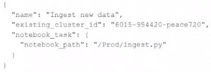

A junior data engineer has configured a workload that posts the following JSON to the Databricks REST API endpoint 2.0/jobs/create.Assuming that all configurations and referenced resources are available, which statement describes the result of executing this workload three times?

- A.Three new jobs named "Ingest new data" will be defined in the workspace, and they will each run once daily.
- B.The logic defined in the referenced notebook will be executed three times on new clusters with the configurations of the provided cluster ID.
- C.Three new jobs named "Ingest new data" will be defined in the workspace, but no jobs will be executed.
- D.One new job named "Ingest new data" will be defined in the workspace, but it will not be executed.
- E.The logic defined in the referenced notebook will be executed three times on the referenced existing all purpose cluster.

---

### Question 13

An upstream system is emitting change data capture (CDC) logs that are being written to a cloud object storage directory. Each record in the log indicates the change type (insert, update, or delete) and the values for each field after the change. The source table has a primary key identified by the field pk_id.For auditing purposes, the data governance team wishes to maintain a full record of all values that have ever been valid in the source system. For analytical purposes, only the most recent value for each record needs to be recorded. The Databricks job to ingest these records occurs once per hour, but each individual record may have changed multiple times over the course of an hour.Which solution meets these requirements?

- A.Create a separate history table for each pk_id resolve the current state of the table by running a union all filtering the history tables for the most recent state.
- B.Use MERGE INTO to insert, update, or delete the most recent entry for each pk_id into a bronze table, then propagate all changes throughout the system.
- C.Iterate through an ordered set of changes to the table, applying each in turn; rely on Delta Lake's versioning ability to create an audit log.
- D.Use Delta Lake's change data feed to automatically process CDC data from an external system, propagating all changes to all dependent tables in the Lakehouse.
- E.Ingest all log information into a bronze table; use MERGE INTO to insert, update, or delete the most recent entry for each pk_id into a silver table to recreate the current table state.

---

### Question 14

An hourly batch job is configured to ingest data files from a cloud object storage container where each batch represent all records produced by the source system in a given hour. The batch job to process these records into the Lakehouse is sufficiently delayed to ensure no late-arriving data is missed. The user_id field represents a unique key for the data, which has the following schema: user_id BIGINT, username STRING, user_utc STRING, user_region STRING, last_login BIGINT, auto_pay BOOLEAN, last_updated BIGINTNew records are all ingested into a table named account_history which maintains a full record of all data in the same schema as the source. The next table in the system is named account_current and is implemented as a Type 1 table representing the most recent value for each unique user_id.Assuming there are millions of user accounts and tens of thousands of records processed hourly, which implementation can be used to efficiently update the described account_current table as part of each hourly batch job?

- A.Use Auto Loader to subscribe to new files in the account_history directory; configure a Structured Streaming trigger once job to batch update newly detected files into the account_current table.
- B.Overwrite the account_current table with each batch using the results of a query against the account_history table grouping by user_id and filtering for the max value of last_updated.
- C.Filter records in account_history using the last_updated field and the most recent hour processed, as well as the max last_iogin by user_id write a merge statement to update or insert the most recent value for each user_id.
- D.Use Delta Lake version history to get the difference between the latest version of account_history and one version prior, then write these records to account_current.
- E.Filter records in account_history using the last_updated field and the most recent hour processed, making sure to deduplicate on username; write a merge statement to update or insert the most recent value for each username.

---

### Question 15

A table in the Lakehouse named customer_churn_params is used in churn prediction by the machine learning team. The table contains information about customers derived from a number of upstream sources. Currently, the data engineering team populates this table nightly by overwriting the table with the current valid values derived from upstream data sources.The churn prediction model used by the ML team is fairly stable in production. The team is only interested in making predictions on records that have changed in the past 24 hours.Which approach would simplify the identification of these changed records?

- A.Apply the churn model to all rows in the customer_churn_params table, but implement logic to perform an upsert into the predictions table that ignores rows where predictions have not changed.
- B.Convert the batch job to a Structured Streaming job using the complete output mode; configure a Structured Streaming job to read from the customer_churn_params table and incrementally predict against the churn model.
- C.Calculate the difference between the previous model predictions and the current customer_churn_params on a key identifying unique customers before making new predictions; only make predictions on those customers not in the previous predictions.
- D.Modify the overwrite logic to include a field populated by calling spark.sql.functions.current_timestamp() as data are being written; use this field to identify records written on a particular date.
- E.Replace the current overwrite logic with a merge statement to modify only those records that have changed; write logic to make predictions on the changed records identified by the change data feed.

---

### Question 16

A table is registered with the following code:Both users and orders are Delta Lake tables. Which statement describes the results of querying recent_orders?

- A.All logic will execute at query time and return the result of joining the valid versions of the source tables at the time the query finishes.
- B.All logic will execute when the table is defined and store the result of joining tables to the DBFS; this stored data will be returned when the table is queried.
- C.Results will be computed and cached when the table is defined; these cached results will incrementally update as new records are inserted into source tables.
- D.All logic will execute at query time and return the result of joining the valid versions of the source tables at the time the query began.
- E.The versions of each source table will be stored in the table transaction log; query results will be saved to DBFS with each query.

---

### Question 17

A production workload incrementally applies updates from an external Change Data Capture feed to a Delta Lake table as an always-on Structured Stream job. When data was initially migrated for this table, OPTIMIZE was executed and most data files were resized to 1 GB. Auto Optimize and Auto Compaction were both turned on for the streaming production job. Recent review of data files shows that most data files are under 64 MB, although each partition in the table contains at least 1 GB of data and the total table size is over 10 TB.Which of the following likely explains these smaller file sizes?

- A.Databricks has autotuned to a smaller target file size to reduce duration of MERGE operations
- B.Z-order indices calculated on the table are preventing file compaction
- C.Bloom filter indices calculated on the table are preventing file compaction
- D.Databricks has autotuned to a smaller target file size based on the overall size of data in the table
- E.Databricks has autotuned to a smaller target file size based on the amount of data in each partition

---

### Question 18

Which statement regarding stream-static joins and static Delta tables is correct?

- A.Each microbatch of a stream-static join will use the most recent version of the static Delta table as of each microbatch.
- B.Each microbatch of a stream-static join will use the most recent version of the static Delta table as of the job's initialization.
- C.The checkpoint directory will be used to track state information for the unique keys present in the join.
- D.Stream-static joins cannot use static Delta tables because of consistency issues.
- E.The checkpoint directory will be used to track updates to the static Delta table.

---

### Question 19

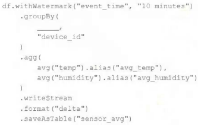

A junior data engineer has been asked to develop a streaming data pipeline with a grouped aggregation using DataFrame df. The pipeline needs to calculate the average humidity and average temperature for each non-overlapping five-minute interval. Events are recorded once per minute per device.Streaming DataFrame df has the following schema:"device_id INT, event_time TIMESTAMP, temp FLOAT, humidity FLOAT"Code block:Choose the response that correctly fills in the blank within the code block to complete this task.

- A.to_interval("event_time", "5 minutes").alias("time")
- B.window("event_time", "5 minutes").alias("time")
- C."event_time"
- D.window("event_time", "10 minutes").alias("time")
- E.lag("event_time", "10 minutes").alias("time")

---

### Question 20

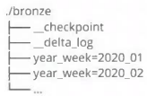

A data architect has designed a system in which two Structured Streaming jobs will concurrently write to a single bronze Delta table. Each job is subscribing to a different topic from an Apache Kafka source, but they will write data with the same schema. To keep the directory structure simple, a data engineer has decided to nest a checkpoint directory to be shared by both streams.The proposed directory structure is displayed below:Which statement describes whether this checkpoint directory structure is valid for the given scenario and why?

- A.No; Delta Lake manages streaming checkpoints in the transaction log.
- B.Yes; both of the streams can share a single checkpoint directory.
- C.No; only one stream can write to a Delta Lake table.
- D.Yes; Delta Lake supports infinite concurrent writers.
- E.No; each of the streams needs to have its own checkpoint directory.

---

### Question 21

A Structured Streaming job deployed to production has been experiencing delays during peak hours of the day. At present, during normal execution, each microbatch of data is processed in less than 3 seconds. During peak hours of the day, execution time for each microbatch becomes very inconsistent, sometimes exceeding 30 seconds. The streaming write is currently configured with a trigger interval of 10 seconds.Holding all other variables constant and assuming records need to be processed in less than 10 seconds, which adjustment will meet the requirement?

- A.Decrease the trigger interval to 5 seconds; triggering batches more frequently allows idle executors to begin processing the next batch while longer running tasks from previous batches finish.
- B.Increase the trigger interval to 30 seconds; setting the trigger interval near the maximum execution time observed for each batch is always best practice to ensure no records are dropped.
- C.The trigger interval cannot be modified without modifying the checkpoint directory; to maintain the current stream state, increase the number of shuffle partitions to maximize parallelism.
- D.Use the trigger once option and configure a Databricks job to execute the query every 10 seconds; this ensures all backlogged records are processed with each batch.
- E.Decrease the trigger interval to 5 seconds; triggering batches more frequently may prevent records from backing up and large batches from causing spill.

---

### Question 22

Which statement describes Delta Lake Auto Compaction?

- A.An asynchronous job runs after the write completes to detect if files could be further compacted; if yes, an OPTIMIZE job is executed toward a default of 1 GB.
- B.Before a Jobs cluster terminates, OPTIMIZE is executed on all tables modified during the most recent job.
- C.Optimized writes use logical partitions instead of directory partitions; because partition boundaries are only represented in metadata, fewer small files are written.
- D.Data is queued in a messaging bus instead of committing data directly to memory; all data is committed from the messaging bus in one batch once the job is complete.
- E.An asynchronous job runs after the write completes to detect if files could be further compacted; if yes, an OPTIMIZE job is executed toward a default of 128 MB.

---

### Question 23

Which statement characterizes the general programming model used by Spark Structured Streaming?

- A.Structured Streaming leverages the parallel processing of GPUs to achieve highly parallel data throughput.
- B.Structured Streaming is implemented as a messaging bus and is derived from Apache Kafka.
- C.Structured Streaming uses specialized hardware and I/O streams to achieve sub-second latency for data transfer.
- D.Structured Streaming models new data arriving in a data stream as new rows appended to an unbounded table.
- E.Structured Streaming relies on a distributed network of nodes that hold incremental state values for cached stages.

---

### Question 24

Which configuration parameter directly affects the size of a spark-partition upon ingestion of data into Spark?

- A.spark.sql.files.maxPartitionBytes
- B.spark.sql.autoBroadcastJoinThreshold
- C.spark.sql.files.openCostInBytes
- D.spark.sql.adaptive.coalescePartitions.minPartitionNum
- E.spark.sql.adaptive.advisoryPartitionSizeInBytes

---

### Question 25

A Spark job is taking longer than expected. Using the Spark UI, a data engineer notes that the Min, Median, and Max Durations for tasks in a particular stage show the minimum and median time to complete a task as roughly the same, but the max duration for a task to be roughly 100 times as long as the minimum.Which situation is causing increased duration of the overall job?

- A.Task queueing resulting from improper thread pool assignment.
- B.Spill resulting from attached volume storage being too small.
- C.Network latency due to some cluster nodes being in different regions from the source data
- D.Skew caused by more data being assigned to a subset of spark-partitions.
- E.Credential validation errors while pulling data from an external system.

---

### Question 26

Each configuration below is identical to the extent that each cluster has 400 GB total of RAM, 160 total cores and only one Executor per VM.Given a job with at least one wide transformation, which of the following cluster configurations will result in maximum performance?

- A.• Total VMs; 1• 400 GB per Executor• 160 Cores / Executor
- B.• Total VMs: 8• 50 GB per Executor• 20 Cores / Executor
- C.• Total VMs: 16• 25 GB per Executor• 10 Cores/Executor
- D.• Total VMs: 4• 100 GB per Executor• 40 Cores/Executor
- E.• Total VMs:2• 200 GB per Executor• 80 Cores / Executor

---

### Question 27

A junior data engineer on your team has implemented the following code block.The view new_events contains a batch of records with the same schema as the events Delta table. The event_id field serves as a unique key for this table.When this query is executed, what will happen with new records that have the same event_id as an existing record?

- A.They are merged.
- B.They are ignored.
- C.They are updated.
- D.They are inserted.
- E.They are deleted.

---

### Question 28

A junior data engineer seeks to leverage Delta Lake's Change Data Feed functionality to create a Type 1 table representing all of the values that have ever been valid for all rows in a bronze table created with the property delta.enableChangeDataFeed = true. They plan to execute the following code as a daily job:Which statement describes the execution and results of running the above query multiple times?

- A.Each time the job is executed, newly updated records will be merged into the target table, overwriting previous values with the same primary keys.
- B.Each time the job is executed, the entire available history of inserted or updated records will be appended to the target table, resulting in many duplicate entries.
- C.Each time the job is executed, the target table will be overwritten using the entire history of inserted or updated records, giving the desired result.
- D.Each time the job is executed, the differences between the original and current versions are calculated; this may result in duplicate entries for some records.
- E.Each time the job is executed, only those records that have been inserted or updated since the last execution will be appended to the target table, giving the desired result.

---

### Question 29

A new data engineer notices that a critical field was omitted from an application that writes its Kafka source to Delta Lake. This happened even though the critical field was in the Kafka source. That field was further missing from data written to dependent, long-term storage. The retention threshold on the Kafka service is seven days. The pipeline has been in production for three months.Which describes how Delta Lake can help to avoid data loss of this nature in the future?

- A.The Delta log and Structured Streaming checkpoints record the full history of the Kafka producer.
- B.Delta Lake schema evolution can retroactively calculate the correct value for newly added fields, as long as the data was in the original source.
- C.Delta Lake automatically checks that all fields present in the source data are included in the ingestion layer.
- D.Data can never be permanently dropped or deleted from Delta Lake, so data loss is not possible under any circumstance.
- E.Ingesting all raw data and metadata from Kafka to a bronze Delta table creates a permanent, replayable history of the data state.

---

### Question 30

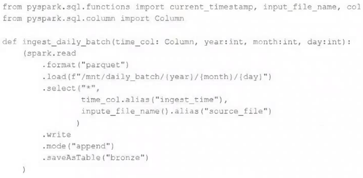

A nightly job ingests data into a Delta Lake table using the following code:The next step in the pipeline requires a function that returns an object that can be used to manipulate new records that have not yet been processed to the next table in the pipeline.Which code snippet completes this function definition?def new_records():

- A.return spark.readStream.table("bronze")
- B.return spark.readStream.load("bronze")
- C.
- D.return spark.read.option("readChangeFeed", "true").table ("bronze")
- E.
- 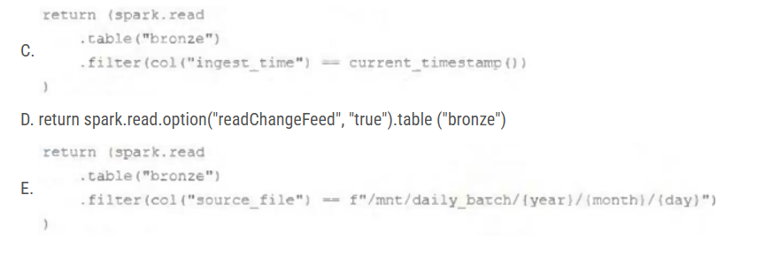
---

### Question 31

A junior data engineer is working to implement logic for a Lakehouse table named silver_device_recordings. The source data contains 100 unique fields in a highly nested JSON structure.The silver_device_recordings table will be used downstream to power several production monitoring dashboards and a production model. At present, 45 of the 100 fields are being used in at least one of these applications.The data engineer is trying to determine the best approach for dealing with schema declaration given the highly-nested structure of the data and the numerous fields.Which of the following accurately presents information about Delta Lake and Databricks that may impact their decision-making process?

- A.The Tungsten encoding used by Databricks is optimized for storing string data; newly-added native support for querying JSON strings means that string types are always most efficient.
- B.Because Delta Lake uses Parquet for data storage, data types can be easily evolved by just modifying file footer information in place.
- C.Human labor in writing code is the largest cost associated with data engineering workloads; as such, automating table declaration logic should be a priority in all migration workloads.
- D.Because Databricks will infer schema using types that allow all observed data to be processed, setting types manually provides greater assurance of data quality enforcement.
- E.Schema inference and evolution on Databricks ensure that inferred types will always accurately match the data types used by downstream systems.

---

### Question 32

The data engineering team maintains the following code:Assuming that this code produces logically correct results and the data in the source tables has been de-duplicated and validated, which statement describes what will occur when this code is executed?

- A.A batch job will update the enriched_itemized_orders_by_account table, replacing only those rows that have different values than the current version of the table, using accountID as the primary key.
- B.The enriched_itemized_orders_by_account table will be overwritten using the current valid version of data in each of the three tables referenced in the join logic.
- C.An incremental job will leverage information in the state store to identify unjoined rows in the source tables and write these rows to the enriched_iteinized_orders_by_account table.
- D.An incremental job will detect if new rows have been written to any of the source tables; if new rows are detected, all results will be recalculated and used to overwrite the enriched_itemized_orders_by_account table.
- E.No computation will occur until enriched_itemized_orders_by_account is queried; upon query materialization, results will be calculated using the current valid version of data in each of the three tables referenced in the join logic.

---

### Question 33

The data engineering team is migrating an enterprise system with thousands of tables and views into the Lakehouse. They plan to implement the target architecture using a series of bronze, silver, and gold tables. Bronze tables will almost exclusively be used by production data engineering workloads, while silver tables will be used to support both data engineering and machine learning workloads. Gold tables will largely serve business intelligence and reporting purposes. While personal identifying information (PII) exists in all tiers of data, pseudonymization and anonymization rules are in place for all data at the silver and gold levels.The organization is interested in reducing security concerns while maximizing the ability to collaborate across diverse teams.Which statement exemplifies best practices for implementing this system?

- A.Isolating tables in separate databases based on data quality tiers allows for easy permissions management through database ACLs and allows physical separation of default storage locations for managed tables.
- B.Because databases on Databricks are merely a logical construct, choices around database organization do not impact security or discoverability in the Lakehouse.
- C.Storing all production tables in a single database provides a unified view of all data assets available throughout the Lakehouse, simplifying discoverability by granting all users view privileges on this database.
- D.Working in the default Databricks database provides the greatest security when working with managed tables, as these will be created in the DBFS root.
- E.Because all tables must live in the same storage containers used for the database they're created in, organizations should be prepared to create between dozens and thousands of databases depending on their data isolation requirements.

---

### Question 34

The data architect has mandated that all tables in the Lakehouse should be configured as external Delta Lake tables.Which approach will ensure that this requirement is met?

- A.Whenever a database is being created, make sure that the LOCATION keyword is used
- B.When configuring an external data warehouse for all table storage, leverage Databricks for all ELT.
- C.Whenever a table is being created, make sure that the LOCATION keyword is used.
- D.When tables are created, make sure that the EXTERNAL keyword is used in the CREATE TABLE statement.
- E.When the workspace is being configured, make sure that external cloud object storage has been mounted.

---

### Question 35

To reduce storage and compute costs, the data engineering team has been tasked with curating a series of aggregate tables leveraged by business intelligence dashboards, customer-facing applications, production machine learning models, and ad hoc analytical queries.The data engineering team has been made aware of new requirements from a customer-facing application, which is the only downstream workload they manage entirely. As a result, an aggregate table used by numerous teams across the organization will need to have a number of fields renamed, and additional fields will also be added.Which of the solutions addresses the situation while minimally interrupting other teams in the organization without increasing the number of tables that need to be managed?

- A.Send all users notice that the schema for the table will be changing; include in the communication the logic necessary to revert the new table schema to match historic queries.
- B.Configure a new table with all the requisite fields and new names and use this as the source for the customer-facing application; create a view that maintains the original data schema and table name by aliasing select fields from the new table.
- C.Create a new table with the required schema and new fields and use Delta Lake's deep clone functionality to sync up changes committed to one table to the corresponding table.
- D.Replace the current table definition with a logical view defined with the query logic currently writing the aggregate table; create a new table to power the customer-facing application.
- E.Add a table comment warning all users that the table schema and field names will be changing on a given date; overwrite the table in place to the specifications of the customer-facing application.

---

### Question 36

A Delta Lake table representing metadata about content posts from users has the following schema: user_id LONG, post_text STRING, post_id STRING, longitude FLOAT, latitude FLOAT, post_time TIMESTAMP, date DATEThis table is partitioned by the date column. A query is run with the following filter: longitude < 20 & longitude > -20Which statement describes how data will be filtered?

- A.Statistics in the Delta Log will be used to identify partitions that might Include files in the filtered range.
- B.No file skipping will occur because the optimizer does not know the relationship between the partition column and the longitude.
- C.The Delta Engine will use row-level statistics in the transaction log to identify the flies that meet the filter criteria.
- D.Statistics in the Delta Log will be used to identify data files that might include records in the filtered range.
- E.The Delta Engine will scan the parquet file footers to identify each row that meets the filter criteria.

---

### Question 37

A small company based in the United States has recently contracted a consulting firm in India to implement several new data engineering pipelines to power artificial intelligence applications. All the company's data is stored in regional cloud storage in the United States.The workspace administrator at the company is uncertain about where the Databricks workspace used by the contractors should be deployed.Assuming that all data governance considerations are accounted for, which statement accurately informs this decision?

- A.Databricks runs HDFS on cloud volume storage; as such, cloud virtual machines must be deployed in the region where the data is stored.
- B.Databricks workspaces do not rely on any regional infrastructure; as such, the decision should be made based upon what is most convenient for the workspace administrator.
- C.Cross-region reads and writes can incur significant costs and latency; whenever possible, compute should be deployed in the same region the data is stored.
- D.Databricks leverages user workstations as the driver during interactive development; as such, users should always use a workspace deployed in a region they are physically near.
- E.Databricks notebooks send all executable code from the user’s browser to virtual machines over the open internet; whenever possible, choosing a workspace region near the end users is the most secure.

---

### Question 38

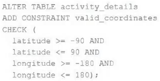

The downstream consumers of a Delta Lake table have been complaining about data quality issues impacting performance in their applications. Specifically, they have complained that invalid latitude and longitude values in the activity_details table have been breaking their ability to use other geolocation processes.A junior engineer has written the following code to add CHECK constraints to the Delta Lake table:A senior engineer has confirmed the above logic is correct and the valid ranges for latitude and longitude are provided, but the code fails when executed.Which statement explains the cause of this failure?

- A.Because another team uses this table to support a frequently running application, two-phase locking is preventing the operation from committing.
- B.The activity_details table already exists; CHECK constraints can only be added during initial table creation.
- C.The activity_details table already contains records that violate the constraints; all existing data must pass CHECK constraints in order to add them to an existing table.
- D.The activity_details table already contains records; CHECK constraints can only be added prior to inserting values into a table.
- E.The current table schema does not contain the field valid_coordinates; schema evolution will need to be enabled before altering the table to add a constraint.

---

### Question 39

Which of the following is true of Delta Lake and the Lakehouse?

- A.Because Parquet compresses data row by row. strings will only be compressed when a character is repeated multiple times.
- B.Delta Lake automatically collects statistics on the first 32 columns of each table which are leveraged in data skipping based on query filters.
- C.Views in the Lakehouse maintain a valid cache of the most recent versions of source tables at all times.
- D.Primary and foreign key constraints can be leveraged to ensure duplicate values are never entered into a dimension table.
- E.Z-order can only be applied to numeric values stored in Delta Lake tables.

---

### Question 40

The view updates represents an incremental batch of all newly ingested data to be inserted or updated in the customers table.The following logic is used to process these records.Which statement describes this implementation?

- A.The customers table is implemented as a Type 3 table; old values are maintained as a new column alongside the current value.
- B.The customers table is implemented as a Type 2 table; old values are maintained but marked as no longer current and new values are inserted.
- C.The customers table is implemented as a Type 0 table; all writes are append only with no changes to existing values.
- D.The customers table is implemented as a Type 1 table; old values are overwritten by new values and no history is maintained.
- E.The customers table is implemented as a Type 2 table; old values are overwritten and new customers are appended.

---

### Question 41

The DevOps team has configured a production workload as a collection of notebooks scheduled to run daily using the Jobs UI. A new data engineering hire is onboarding to the team and has requested access to one of these notebooks to review the production logic.What are the maximum notebook permissions that can be granted to the user without allowing accidental changes to production code or data?

- A.Can Manage
- B.Can Edit
- C.No permissions
- D.Can Read
- E.Can Run

---

### Question 42

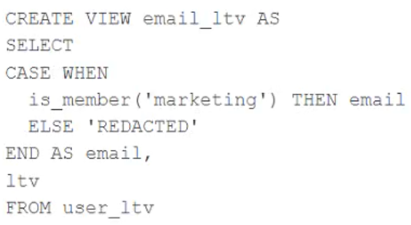

A table named user_ltv is being used to create a view that will be used by data analysts on various teams. Users in the workspace are configured into groups, which are used for setting up data access using ACLs.The user_ltv table has the following schema:email STRING, age INT, ltv INTThe following view definition is executed:An analyst who is not a member of the marketing group executes the following query:SELECT * FROM email_ltv -Which statement describes the results returned by this query?

- A.Three columns will be returned, but one column will be named "REDACTED" and contain only null values.
- B.Only the email and ltv columns will be returned; the email column will contain all null values.
- C.The email and ltv columns will be returned with the values in user_ltv.
- D.The email.age, and ltv columns will be returned with the values in user_ltv.
- E.Only the email and ltv columns will be returned; the email column will contain the string "REDACTED" in each row.

---

### Question 43

The data governance team has instituted a requirement that all tables containing Personal Identifiable Information (PH) must be clearly annotated. This includes adding column comments, table comments, and setting the custom table property "contains_pii" = true.The following SQL DDL statement is executed to create a new table:Which command allows manual confirmation that these three requirements have been met?

- A.DESCRIBE EXTENDED dev.pii_test
- B.DESCRIBE DETAIL dev.pii_test
- C.SHOW TBLPROPERTIES dev.pii_test
- D.DESCRIBE HISTORY dev.pii_test
- E.SHOW TABLES dev

---

### Question 44

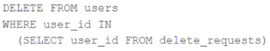

The data governance team is reviewing code used for deleting records for compliance with GDPR. They note the following logic is used to delete records from the Delta Lake table named users.Assuming that user_id is a unique identifying key and that delete_requests contains all users that have requested deletion, which statement describes whether successfully executing the above logic guarantees that the records to be deleted are no longer accessible and why?

- A.Yes; Delta Lake ACID guarantees provide assurance that the DELETE command succeeded fully and permanently purged these records.
- B.No; the Delta cache may return records from previous versions of the table until the cluster is restarted.
- C.Yes; the Delta cache immediately updates to reflect the latest data files recorded to disk.
- D.No; the Delta Lake DELETE command only provides ACID guarantees when combined with the MERGE INTO command.
- E.No; files containing deleted records may still be accessible with time travel until a VACUUM command is used to remove invalidated data files.

---

### Question 45

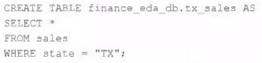

An external object storage container has been mounted to the location /mnt/finance_eda_bucket.The following logic was executed to create a database for the finance team:After the database was successfully created and permissions configured, a member of the finance team runs the following code:If all users on the finance team are members of the finance group, which statement describes how the tx_sales table will be created?

- A.A logical table will persist the query plan to the Hive Metastore in the Databricks control plane.
- B.An external table will be created in the storage container mounted to /mnt/finance_eda_bucket.
- C.A logical table will persist the physical plan to the Hive Metastore in the Databricks control plane.
- D.An managed table will be created in the storage container mounted to /mnt/finance_eda_bucket.
- E.A managed table will be created in the DBFS root storage container.

---

### Question 46

Although the Databricks Utilities Secrets module provides tools to store sensitive credentials and avoid accidentally displaying them in plain text users should still be careful with which credentials are stored here and which users have access to using these secrets.Which statement describes a limitation of Databricks Secrets?

- A.Because the SHA256 hash is used to obfuscate stored secrets, reversing this hash will display the value in plain text.
- B.Account administrators can see all secrets in plain text by logging on to the Databricks Accounts console.
- C.Secrets are stored in an administrators-only table within the Hive Metastore; database administrators have permission to query this table by default.
- D.Iterating through a stored secret and printing each character will display secret contents in plain text.
- E.The Databricks REST API can be used to list secrets in plain text if the personal access token has proper credentials.

---

### Question 47

What statement is true regarding the retention of job run history?

- A.It is retained until you export or delete job run logs
- B.It is retained for 30 days, during which time you can deliver job run logs to DBFS or S3
- C.It is retained for 60 days, during which you can export notebook run results to HTML
- D.It is retained for 60 days, after which logs are archived
- E.It is retained for 90 days or until the run-id is re-used through custom run configuration

---

### Question 48

A data engineer, User A, has promoted a new pipeline to production by using the REST API to programmatically create several jobs. A DevOps engineer, User B, has configured an external orchestration tool to trigger job runs through the REST API. Both users authorized the REST API calls using their personal access tokens.Which statement describes the contents of the workspace audit logs concerning these events?

- A.Because the REST API was used for job creation and triggering runs, a Service Principal will be automatically used to identify these events.
- B.Because User B last configured the jobs, their identity will be associated with both the job creation events and the job run events.
- C.Because these events are managed separately, User A will have their identity associated with the job creation events and User B will have their identity associated with the job run events.
- D.Because the REST API was used for job creation and triggering runs, user identity will not be captured in the audit logs.
- E.Because User A created the jobs, their identity will be associated with both the job creation events and the job run events.

---

### Question 49

A user new to Databricks is trying to troubleshoot long execution times for some pipeline logic they are working on. Presently, the user is executing code cell-by-cell, using display() calls to confirm code is producing the logically correct results as new transformations are added to an operation. To get a measure of average time to execute, the user is running each cell multiple times interactively.Which of the following adjustments will get a more accurate measure of how code is likely to perform in production?

- A.Scala is the only language that can be accurately tested using interactive notebooks; because the best performance is achieved by using Scala code compiled to JARs, all PySpark and Spark SQL logic should be refactored.
- B.The only way to meaningfully troubleshoot code execution times in development notebooks Is to use production-sized data and production-sized clusters with Run All execution.
- C.Production code development should only be done using an IDE; executing code against a local build of open source Spark and Delta Lake will provide the most accurate benchmarks for how code will perform in production.
- D.Calling display() forces a job to trigger, while many transformations will only add to the logical query plan; because of caching, repeated execution of the same logic does not provide meaningful results.
- E.The Jobs UI should be leveraged to occasionally run the notebook as a job and track execution time during incremental code development because Photon can only be enabled on clusters launched for scheduled jobs.

---

### Question 50

A production cluster has 3 executor nodes and uses the same virtual machine type for the driver and executor.When evaluating the Ganglia Metrics for this cluster, which indicator would signal a bottleneck caused by code executing on the driver?

- A.The five Minute Load Average remains consistent/flat
- B.Bytes Received never exceeds 80 million bytes per second
- C.Total Disk Space remains constant
- D.Network I/O never spikes
- E.Overall cluster CPU utilization is around 25%

---

### Question 51

Where in the Spark UI can one diagnose a performance problem induced by not leveraging predicate push-down?

- A.In the Executor’s log file, by grepping for "predicate push-down"
- B.In the Stage’s Detail screen, in the Completed Stages table, by noting the size of data read from the Input column
- C.In the Storage Detail screen, by noting which RDDs are not stored on disk
- D.In the Delta Lake transaction log. by noting the column statistics
- E.In the Query Detail screen, by interpreting the Physical Plan

---

### Question 52

Review the following error traceback:Which statement describes the error being raised?

- A.The code executed was PySpark but was executed in a Scala notebook.
- B.There is no column in the table named heartrateheartrateheartrate
- C.There is a type error because a column object cannot be multiplied.
- D.There is a type error because a DataFrame object cannot be multiplied.
- E.There is a syntax error because the heartrate column is not correctly identified as a column.

---

### Question 53

Which distribution does Databricks support for installing custom Python code packages?

- A.sbt
- B.CRANC. npm
- D.Wheels
- E.jars

---

### Question 54

Which Python variable contains a list of directories to be searched when trying to locate required modules?

- A.importlib.resource_path
- B.sys.path
- C.os.path
- D.pypi.path
- E.pylib.source

---

### Question 55

Incorporating unit tests into a PySpark application requires upfront attention to the design of your jobs, or a potentially significant refactoring of existing code.Which statement describes a main benefit that offset this additional effort?

- A.Improves the quality of your data
- B.Validates a complete use case of your application
- C.Troubleshooting is easier since all steps are isolated and tested individually
- D.Yields faster deployment and execution times
- E.Ensures that all steps interact correctly to achieve the desired end result

---

### Question 56

Which statement describes integration testing?

- A.Validates interactions between subsystems of your application
- B.Requires an automated testing framework
- C.Requires manual intervention
- D.Validates an application use case
- E.Validates behavior of individual elements of your application

---

### Question 57

Which REST API call can be used to review the notebooks configured to run as tasks in a multi-task job?

- A./jobs/runs/list
- B./jobs/runs/get-output
- C./jobs/runs/get
- D./jobs/get
- E./jobs/list

---

### Question 58

A Databricks job has been configured with 3 tasks, each of which is a Databricks notebook. Task A does not depend on other tasks. Tasks B and C run in parallel, with each having a serial dependency on task A.If tasks A and B complete successfully but task C fails during a scheduled run, which statement describes the resulting state?

- A.All logic expressed in the notebook associated with tasks A and B will have been successfully completed; some operations in task C may have completed successfully.
- B.All logic expressed in the notebook associated with tasks A and B will have been successfully completed; any changes made in task C will be rolled back due to task failure.
- C.All logic expressed in the notebook associated with task A will have been successfully completed; tasks B and C will not commit any changes because of stage failure.
- D.Because all tasks are managed as a dependency graph, no changes will be committed to the Lakehouse until ail tasks have successfully been completed.
- E.Unless all tasks complete successfully, no changes will be committed to the Lakehouse; because task C failed, all commits will be rolled back automatically.

---

### Question 59

A Delta Lake table was created with the below query:Realizing that the original query had a typographical error, the below code was executed:ALTER TABLE prod.sales_by_stor RENAME TO prod.sales_by_storeWhich result will occur after running the second command?

- A.The table reference in the metastore is updated and no data is changed.
- B.The table name change is recorded in the Delta transaction log.
- C.All related files and metadata are dropped and recreated in a single ACID transaction.
- D.The table reference in the metastore is updated and all data files are moved.
- E.A new Delta transaction log Is created for the renamed table.

---

### Question 60

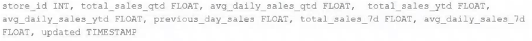

The data engineering team maintains a table of aggregate statistics through batch nightly updates. This includes total sales for the previous day alongside totals and averages for a variety of time periods including the 7 previous days, year-to-date, and quarter-to-date. This table is named store_saies_summary and the schema is as follows:The table daily_store_sales contains all the information needed to update store_sales_summary. The schema for this table is: store_id INT, sales_date DATE, total_sales FLOATIf daily_store_sales is implemented as a Type 1 table and the total_sales column might be adjusted after manual data auditing, which approach is the safest to generate accurate reports in the store_sales_summary table?

- A.Implement the appropriate aggregate logic as a batch read against the daily_store_sales table and overwrite the store_sales_summary table with each Update.
- B.Implement the appropriate aggregate logic as a batch read against the daily_store_sales table and append new rows nightly to the store_sales_summary table.
- C.Implement the appropriate aggregate logic as a batch read against the daily_store_sales table and use upsert logic to update results in the store_sales_summary table.
- D.Implement the appropriate aggregate logic as a Structured Streaming read against the daily_store_sales table and use upsert logic to update results in the store_sales_summary table.
- E.Use Structured Streaming to subscribe to the change data feed for daily_store_sales and apply changes to the aggregates in the store_sales_summary table with each update.

---

### Question 61

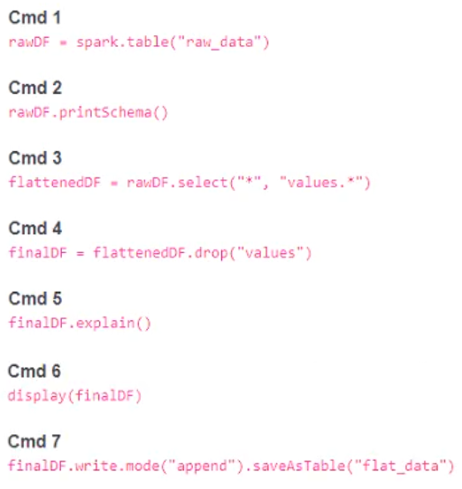

A member of the data engineering team has submitted a short notebook that they wish to schedule as part of a larger data pipeline. Assume that the commands provided below produce the logically correct results when run as presented.Which command should be removed from the notebook before scheduling it as a job?

- A.Cmd 2
- B.Cmd 3
- C.Cmd 4
- D.Cmd 5
- E.Cmd 6

---

### Question 62

The business reporting team requires that data for their dashboards be updated every hour. The total processing time for the pipeline that extracts transforms, and loads the data for their pipeline runs in 10 minutes.Assuming normal operating conditions, which configuration will meet their service-level agreement requirements with the lowest cost?

- A.Manually trigger a job anytime the business reporting team refreshes their dashboards
- B.Schedule a job to execute the pipeline once an hour on a new job cluster
- C.Schedule a Structured Streaming job with a trigger interval of 60 minutes
- D.Schedule a job to execute the pipeline once an hour on a dedicated interactive cluster
- E.Configure a job that executes every time new data lands in a given directory

---

### Question 63

A Databricks SQL dashboard has been configured to monitor the total number of records present in a collection of Delta Lake tables using the following query pattern:SELECT COUNT (*) FROM table -Which of the following describes how results are generated each time the dashboard is updated?

- A.The total count of rows is calculated by scanning all data files
- B.The total count of rows will be returned from cached results unless REFRESH is run
- C.The total count of records is calculated from the Delta transaction logs
- D.The total count of records is calculated from the parquet file metadata
- E.The total count of records is calculated from the Hive metastore

---

### Question 64

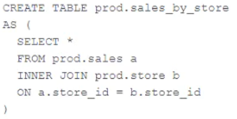

A Delta Lake table was created with the below query:Consider the following query:DROP TABLE prod.sales_by_store -If this statement is executed by a workspace admin, which result will occur?

- A.Nothing will occur until a COMMIT command is executed.
- B.The table will be removed from the catalog but the data will remain in storage.
- C.The table will be removed from the catalog and the data will be deleted.
- D.An error will occur because Delta Lake prevents the deletion of production data.
- E.Data will be marked as deleted but still recoverable with Time Travel.

---

### Question 65

Two of the most common data locations on Databricks are the DBFS root storage and external object storage mounted with dbutils.fs.mount().Which of the following statements is correct?

- A.DBFS is a file system protocol that allows users to interact with files stored in object storage using syntax and guarantees similar to Unix file systems.
- B.By default, both the DBFS root and mounted data sources are only accessible to workspace administrators.
- C.The DBFS root is the most secure location to store data, because mounted storage volumes must have full public read and write permissions.
- D.Neither the DBFS root nor mounted storage can be accessed when using %sh in a Databricks notebook.
- E.The DBFS root stores files in ephemeral block volumes attached to the driver, while mounted directories will always persist saved data to external storage between sessions.

---

### Question 66

The following code has been migrated to a Databricks notebook from a legacy workload:The code executes successfully and provides the logically correct results, however, it takes over 20 minutes to extract and load around 1 GB of data.Which statement is a possible explanation for this behavior?

- A.%sh triggers a cluster restart to collect and install Git. Most of the latency is related to cluster startup time.
- B.Instead of cloning, the code should use %sh pip install so that the Python code can get executed in parallel across all nodes in a cluster.
- C.%sh does not distribute file moving operations; the final line of code should be updated to use %fs instead.
- D.Python will always execute slower than Scala on Databricks. The run.py script should be refactored to Scala.
- E.%sh executes shell code on the driver node. The code does not take advantage of the worker nodes or Databricks optimized Spark.

---

### Question 67

The data science team has requested assistance in accelerating queries on free form text from user reviews. The data is currently stored in Parquet with the below schema:item_id INT, user_id INT, review_id INT, rating FLOAT, review STRINGThe review column contains the full text of the review left by the user. Specifically, the data science team is looking to identify if any of 30 key words exist in this field.A junior data engineer suggests converting this data to Delta Lake will improve query performance.Which response to the junior data engineer s suggestion is correct?

- A.Delta Lake statistics are not optimized for free text fields with high cardinality.
- B.Text data cannot be stored with Delta Lake.
- C.ZORDER ON review will need to be run to see performance gains.
- D.The Delta log creates a term matrix for free text fields to support selective filtering.
- E.Delta Lake statistics are only collected on the first 4 columns in a table.

---

### Question 68

Assuming that the Databricks CLI has been installed and configured correctly, which Databricks CLI command can be used to upload a custom Python Wheel to object storage mounted with the DBFS for use with a production job?

- A.configure
- B.fs
- C.jobs
- D.libraries
- E.workspace

---

### Question 69

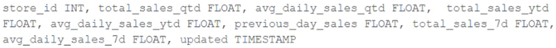

The business intelligence team has a dashboard configured to track various summary metrics for retail stores. This includes total sales for the previous day alongside totals and averages for a variety of time periods. The fields required to populate this dashboard have the following schema:For demand forecasting, the Lakehouse contains a validated table of all itemized sales updated incrementally in near real-time. This table, named products_per_order, includes the following fields:Because reporting on long-term sales trends is less volatile, analysts using the new dashboard only require data to be refreshed once daily. Because the dashboard will be queried interactively by many users throughout a normal business day, it should return results quickly and reduce total compute associated with each materialization.Which solution meets the expectations of the end users while controlling and limiting possible costs?

- A.Populate the dashboard by configuring a nightly batch job to save the required values as a table overwritten with each update.
- B.Use Structured Streaming to configure a live dashboard against the products_per_order table within a Databricks notebook.
- C.Configure a webhook to execute an incremental read against products_per_order each time the dashboard is refreshed.
- D.Use the Delta Cache to persist the products_per_order table in memory to quickly update the dashboard with each query.
- E.Define a view against the products_per_order table and define the dashboard against this view.

---

### Question 70

A data ingestion task requires a one-TB JSON dataset to be written out to Parquet with a target part-file size of 512 MB. Because Parquet is being used instead of Delta Lake, built-in file-sizing features such as Auto-Optimize & Auto-Compaction cannot be used.Which strategy will yield the best performance without shuffling data?

- A.Set spark.sql.files.maxPartitionBytes to 512 MB, ingest the data, execute the narrow transformations, and then write to parquet.
- B.Set spark.sql.shuffle.partitions to 2,048 partitions (1TB*1024*1024/512), ingest the data, execute the narrow transformations, optimize the data by sorting it (which automatically repartitions the data), and then write to parquet.
- C.Set spark.sql.adaptive.advisoryPartitionSizeInBytes to 512 MB bytes, ingest the data, execute the narrow transformations, coalesce to 2,048 partitions (1TB*1024*1024/512), and then write to parquet.
- D.Ingest the data, execute the narrow transformations, repartition to 2,048 partitions (1TB* 1024*1024/512), and then write to parquet.
- E.Set spark.sql.shuffle.partitions to 512, ingest the data, execute the narrow transformations, and then write to parquet.

---

### Question 71

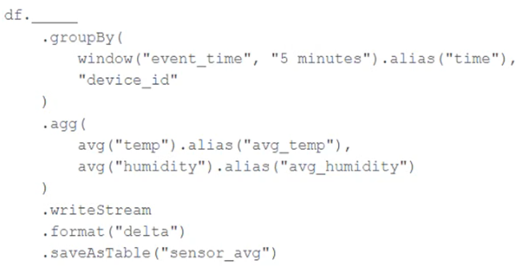

A junior data engineer has been asked to develop a streaming data pipeline with a grouped aggregation using DataFrame df. The pipeline needs to calculate the average humidity and average temperature for each non-overlapping five-minute interval. Incremental state information should be maintained for 10 minutes for late-arriving data.Streaming DataFrame df has the following schema:"device_id INT, event_time TIMESTAMP, temp FLOAT, humidity FLOAT"Code block:Choose the response that correctly fills in the blank within the code block to complete this task.

- A.withWatermark("event_time", "10 minutes")
- B.awaitArrival("event_time", "10 minutes")
- C.await("event_time + ‘10 minutes'")
- D.slidingWindow("event_time", "10 minutes")
- E.delayWrite("event_time", "10 minutes")

---

### Question 72

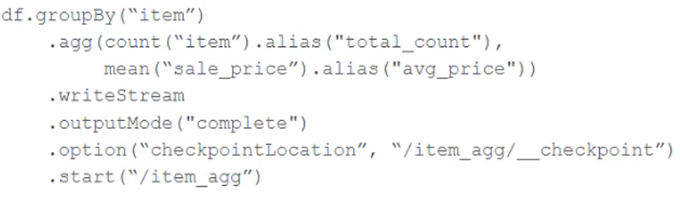

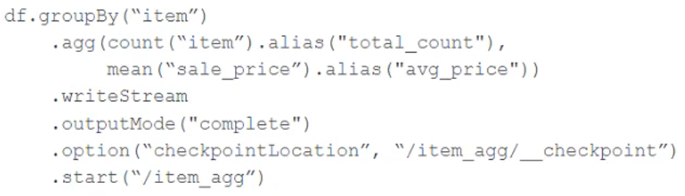

A data team's Structured Streaming job is configured to calculate running aggregates for item sales to update a downstream marketing dashboard. The marketing team has introduced a new promotion, and they would like to add a new field to track the number of times this promotion code is used for each item. A junior data engineer suggests updating the existing query as follows. Note that proposed changes are in bold.Original query:Proposed query:Proposed query:.start(“/item_agg”)Which step must also be completed to put the proposed query into production?

- A.Specify a new checkpointLocation
- B.Increase the shuffle partitions to account for additional aggregates
- C.Run REFRESH TABLE delta.'/item_agg'
- D.Register the data in the "/item_agg" directory to the Hive metastore
- E.Remove .option(‘mergeSchema’, ‘true’) from the streaming write

---

### Question 73

A Structured Streaming job deployed to production has been resulting in higher than expected cloud storage costs. At present, during normal execution, each microbatch of data is processed in less than 3s; at least 12 times per minute, a microbatch is processed that contains 0 records. The streaming write was configured using the default trigger settings. The production job is currently scheduled alongside many other Databricks jobs in a workspace with instance pools provisioned to reduce start-up time for jobs with batch execution.Holding all other variables constant and assuming records need to be processed in less than 10 minutes, which adjustment will meet the requirement?

- A.Set the trigger interval to 3 seconds; the default trigger interval is consuming too many records per batch, resulting in spill to disk that can increase volume costs.
- B.Increase the number of shuffle partitions to maximize parallelism, since the trigger interval cannot be modified without modifying the checkpoint directory.
- C.Set the trigger interval to 10 minutes; each batch calls APIs in the source storage account, so decreasing trigger frequency to maximum allowable threshold should minimize this cost.
- D.Set the trigger interval to 500 milliseconds; setting a small but non-zero trigger interval ensures that the source is not queried too frequently.
- E.Use the trigger once option and configure a Databricks job to execute the query every 10 minutes; this approach minimizes costs for both compute and storage.

---

### Question 74

Which statement describes the correct use of pyspark.sql.functions.broadcast?

- A.It marks a column as having low enough cardinality to properly map distinct values to available partitions, allowing a broadcast join.
- B.It marks a column as small enough to store in memory on all executors, allowing a broadcast join.
- C.It caches a copy of the indicated table on attached storage volumes for all active clusters within a Databricks workspace.
- D.It marks a DataFrame as small enough to store in memory on all executors, allowing a broadcast join.
- E.It caches a copy of the indicated table on all nodes in the cluster for use in all future queries during the cluster lifetime.

---

### Question 75

A data engineer is configuring a pipeline that will potentially see late-arriving, duplicate records.In addition to de-duplicating records within the batch, which of the following approaches allows the data engineer to deduplicate data against previously processed records as it is inserted into a Delta table?

- A.Set the configuration delta.deduplicate = true.
- B.VACUUM the Delta table after each batch completes.
- C.Perform an insert-only merge with a matching condition on a unique key.
- D.Perform a full outer join on a unique key and overwrite existing data.
- E.Rely on Delta Lake schema enforcement to prevent duplicate records.

---

### Question 76

A data pipeline uses Structured Streaming to ingest data from Apache Kafka to Delta Lake. Data is being stored in a bronze table, and includes the Kafka-generated timestamp, key, and value. Three months after the pipeline is deployed, the data engineering team has noticed some latency issues during certain times of the day.A senior data engineer updates the Delta Table's schema and ingestion logic to include the current timestamp (as recorded by Apache Spark) as well as the Kafka topic and partition. The team plans to use these additional metadata fields to diagnose the transient processing delays.Which limitation will the team face while diagnosing this problem?

- A.New fields will not be computed for historic records.
- B.Spark cannot capture the topic and partition fields from a Kafka source.
- C.New fields cannot be added to a production Delta table.
- D.Updating the table schema will invalidate the Delta transaction log metadata.
- E.Updating the table schema requires a default value provided for each field added.

---

### Question 77

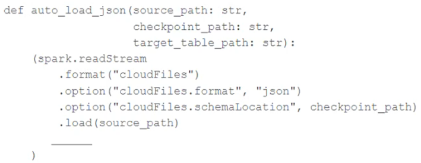

In order to facilitate near real-time workloads, a data engineer is creating a helper function to leverage the schema detection and evolution functionality of Databricks Auto Loader. The desired function will automatically detect the schema of the source directly, incrementally process JSON files as they arrive in a source directory, and automatically evolve the schema of the table when new fields are detected.The function is displayed below with a blank:Which response correctly fills in the blank to meet the specified requirements?

- A.
- B.
- C.
- D.
- E.
- 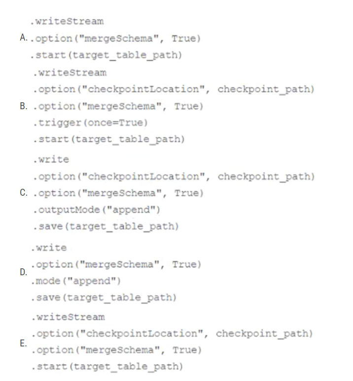

---

### Question 78

The data engineering team maintains the following code:Assuming that this code produces logically correct results and the data in the source table has been de-duplicated and validated, which statement describes what will occur when this code is executed?

- A.The silver_customer_sales table will be overwritten by aggregated values calculated from all records in the gold_customer_lifetime_sales_summary table as a batch job.
- B.A batch job will update the gold_customer_lifetime_sales_summary table, replacing only those rows that have different values than the current version of the table, using customer_id as the primary key.
- C.The gold_customer_lifetime_sales_summary table will be overwritten by aggregated values calculated from all records in the silver_customer_sales table as a batch job.
- D.An incremental job will leverage running information in the state store to update aggregate values in the gold_customer_lifetime_sales_summary table.
- E.An incremental job will detect if new rows have been written to the silver_customer_sales table; if new rows are detected, all aggregates will be recalculated and used to overwrite the gold_customer_lifetime_sales_summary table.

---

### Question 79

The data architect has mandated that all tables in the Lakehouse should be configured as external (also known as "unmanaged") Delta Lake tables.Which approach will ensure that this requirement is met?

- A.When a database is being created, make sure that the LOCATION keyword is used.
- B.When configuring an external data warehouse for all table storage, leverage Databricks for all ELT.
- C.When data is saved to a table, make sure that a full file path is specified alongside the Delta format.
- D.When tables are created, make sure that the EXTERNAL keyword is used in the CREATE TABLE statement.
- E.When the workspace is being configured, make sure that external cloud object storage has been mounted.

---

### Question 80

The marketing team is looking to share data in an aggregate table with the sales organization, but the field names used by the teams do not match, and a number of marketing-specific fields have not been approved for the sales org.Which of the following solutions addresses the situation while emphasizing simplicity?

- A.Create a view on the marketing table selecting only those fields approved for the sales team; alias the names of any fields that should be standardized to the sales naming conventions.
- B.Create a new table with the required schema and use Delta Lake's DEEP CLONE functionality to sync up changes committed to one table to the corresponding table.
- C.Use a CTAS statement to create a derivative table from the marketing table; configure a production job to propagate changes.
- D.Add a parallel table write to the current production pipeline, updating a new sales table that varies as required from the marketing table.
- E.Instruct the marketing team to download results as a CSV and email them to the sales organization.

---

### Question 81

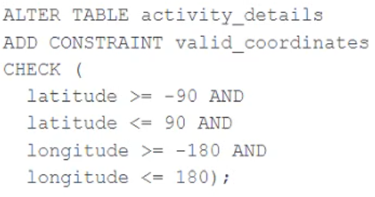

A CHECK constraint has been successfully added to the Delta table named activity_details using the following logic:A batch job is attempting to insert new records to the table, including a record where latitude = 45.50 and longitude = 212.67.Which statement describes the outcome of this batch insert?

- A.The write will fail when the violating record is reached; any records previously processed will be recorded to the target table.
- B.The write will fail completely because of the constraint violation and no records will be inserted into the target table.
- C.The write will insert all records except those that violate the table constraints; the violating records will be recorded to a quarantine table.
- D.The write will include all records in the target table; any violations will be indicated in the boolean column named valid_coordinates.
- E.The write will insert all records except those that violate the table constraints; the violating records will be reported in a warning log.

---

### Question 82

A junior data engineer has manually configured a series of jobs using the Databricks Jobs UI. Upon reviewing their work, the engineer realizes that they are listed as the "Owner" for each job. They attempt to transfer "Owner" privileges to the "DevOps" group, but cannot successfully accomplish this task.Which statement explains what is preventing this privilege transfer?

- A.Databricks jobs must have exactly one owner; "Owner" privileges cannot be assigned to a group.
- B.The creator of a Databricks job will always have "Owner" privileges; this configuration cannot be changed.
- C.Other than the default "admins" group, only individual users can be granted privileges on jobs.
- D.A user can only transfer job ownership to a group if they are also a member of that group.
- E.Only workspace administrators can grant "Owner" privileges to a group.

---

### Question 83

All records from an Apache Kafka producer are being ingested into a single Delta Lake table with the following schema:key BINARY, value BINARY, topic STRING, partition LONG, offset LONG, timestamp LONGThere are 5 unique topics being ingested. Only the "registration" topic contains Personal Identifiable Information (PII). The company wishes to restrict access to PII. The company also wishes to only retain records containing PII in this table for 14 days after initial ingestion. However, for non-PII information, it would like to retain these records indefinitely.Which of the following solutions meets the requirements?

- A.All data should be deleted biweekly; Delta Lake's time travel functionality should be leveraged to maintain a history of non-PII information.
- B.Data should be partitioned by the registration field, allowing ACLs and delete statements to be set for the PII directory.
- C.Because the value field is stored as binary data, this information is not considered PII and no special precautions should be taken.
- D.Separate object storage containers should be specified based on the partition field, allowing isolation at the storage level.
- E.Data should be partitioned by the topic field, allowing ACLs and delete statements to leverage partition boundaries.

---

### Question 84

The data architect has decided that once data has been ingested from external sources into theDatabricks Lakehouse, table access controls will be leveraged to manage permissions for all production tables and views.The following logic was executed to grant privileges for interactive queries on a production database to the core engineering group.GRANT USAGE ON DATABASE prod TO eng;GRANT SELECT ON DATABASE prod TO eng;Assuming these are the only privileges that have been granted to the eng group and that these users are not workspace administrators, which statement describes their privileges?

- A.Group members have full permissions on the prod database and can also assign permissions to other users or groups.
- B.Group members are able to list all tables in the prod database but are not able to see the results of any queries on those tables.
- C.Group members are able to query and modify all tables and views in the prod database, but cannot create new tables or views.
- D.Group members are able to query all tables and views in the prod database, but cannot create or edit anything in the database.
- E.Group members are able to create, query, and modify all tables and views in the prod database, but cannot define custom functions.

---

### Question 85

A distributed team of data analysts share computing resources on an interactive cluster with autoscaling configured. In order to better manage costs and query throughput, the workspace administrator is hoping to evaluate whether cluster upscaling is caused by many concurrent users or resource-intensive queries.In which location can one review the timeline for cluster resizing events?

- A.Workspace audit logs
- B.Driver's log file
- C.Ganglia
- D.Cluster Event Log
- E.Executor's log file

---

### Question 86

When evaluating the Ganglia Metrics for a given cluster with 3 executor nodes, which indicator would signal proper utilization of the VM's resources?

- A.The five Minute Load Average remains consistent/flat
- B.Bytes Received never exceeds 80 million bytes per second
- C.Network I/O never spikes
- D.Total Disk Space remains constant
- E.CPU Utilization is around 75%

---

### Question 87

Which of the following technologies can be used to identify key areas of text when parsing Spark Driver log4j output?

- A.Regex
- B.Julia
- C.pyspsark.ml.feature
- D.Scala Datasets
- E.C++

---

### Question 88

You are testing a collection of mathematical functions, one of which calculates the area under a curve as described by another function.assert(myIntegrate(lambda x: x*x, 0, 3) [0] == 9)Which kind of test would the above line exemplify?

- A.Unit
- B.Manual
- C.Functional
- D.Integration
- E.End-to-end

---

### Question 89

A Databricks job has been configured with 3 tasks, each of which is a Databricks notebook. Task A does not depend on other tasks. Tasks B and C run in parallel, with each having a serial dependency on Task A.If task A fails during a scheduled run, which statement describes the results of this run?

- A.Because all tasks are managed as a dependency graph, no changes will be committed to the Lakehouse until all tasks have successfully been completed.
- B.Tasks B and C will attempt to run as configured; any changes made in task A will be rolled back due to task failure.
- C.Unless all tasks complete successfully, no changes will be committed to the Lakehouse; because task A failed, all commits will be rolled back automatically.
- D.Tasks B and C will be skipped; some logic expressed in task A may have been committed before task failure.
- E.Tasks B and C will be skipped; task A will not commit any changes because of stage failure.

---

### Question 90

Which statement regarding Spark configuration on the Databricks platform is true?

- A.The Databricks REST API can be used to modify the Spark configuration properties for an interactive cluster without interrupting jobs currently running on the cluster.
- B.Spark configurations set within a notebook will affect all SparkSessions attached to the same interactive cluster.
- C.Spark configuration properties can only be set for an interactive cluster by creating a global init script.
- D.Spark configuration properties set for an interactive cluster with the Clusters UI will impact all notebooks attached to that cluster.
- E.When the same Spark configuration property is set for an interactive cluster and a notebook attached to that cluster, the notebook setting will always be ignored.

---

### Question 91

A developer has successfully configured their credentials for Databricks Repos and cloned a remote Git repository. They do not have privileges to make changes to the main branch, which is the only branch currently visible in their workspace.Which approach allows this user to share their code updates without the risk of overwriting the work of their teammates?

- A.Use Repos to checkout all changes and send the git diff log to the team.
- B.Use Repos to create a fork of the remote repository, commit all changes, and make a pull request on the source repository.
- C.Use Repos to pull changes from the remote Git repository; commit and push changes to a branch that appeared as changes were pulled.
- D.Use Repos to merge all differences and make a pull request back to the remote repository.
- E.Use Repos to create a new branch, commit all changes, and push changes to the remote Git repository.

---

### Question 92

In order to prevent accidental commits to production data, a senior data engineer has instituted a policy that all development work will reference clones of Delta Lake tables. After testing both DEEP and SHALLOW CLONE, development tables are created using SHALLOW CLONE.A few weeks after initial table creation, the cloned versions of several tables implemented as Type 1 Slowly Changing Dimension (SCD) stop working. The transaction logs for the source tables show that VACUUM was run the day before.Which statement describes why the cloned tables are no longer working?

- A.Because Type 1 changes overwrite existing records, Delta Lake cannot guarantee data consistency for cloned tables.
- B.Running VACUUM automatically invalidates any shallow clones of a table; DEEP CLONE should always be used when a cloned table will be repeatedly queried.
- C.Tables created with SHALLOW CLONE are automatically deleted after their default retention threshold of 7 days.
- D.The metadata created by the CLONE operation is referencing data files that were purged as invalid by the VACUUM command.
- E.The data files compacted by VACUUM are not tracked by the cloned metadata; running REFRESH on the cloned table will pull in recent changes.

---

### Question 93

You are performing a join operation to combine values from a static userLookup table with a streaming DataFrame streamingDF.Which code block attempts to perform an invalid stream-static join?

- A.userLookup.join(streamingDF, ["userid"], how="inner")
- B.streamingDF.join(userLookup, ["user_id"], how="outer")
- C.streamingDF.join(userLookup, ["user_id”], how="left")
- D.streamingDF.join(userLookup, ["userid"], how="inner")
- E.userLookup.join(streamingDF, ["user_id"], how="right")

---

### Question 94

Spill occurs as a result of executing various wide transformations. However, diagnosing spill requires one to proactively look for key indicators.Where in the Spark UI are two of the primary indicators that a partition is spilling to disk?

- A.Query’s detail screen and Job’s detail screen
- B.Stage’s detail screen and Executor’s log files
- C.Driver’s and Executor’s log files
- D.Executor’s detail screen and Executor’s log files
- E.Stage’s detail screen and Query’s detail screen

---

### Question 95

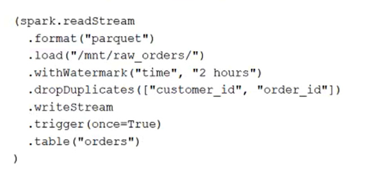

A task orchestrator has been configured to run two hourly tasks. First, an outside system writes Parquet data to a directory mounted at /mnt/raw_orders/. After this data is written, a Databricks job containing the following code is executed:Assume that the fields customer_id and order_id serve as a composite key to uniquely identify each order, and that the time field indicates when the record was queued in the source system.If the upstream system is known to occasionally enqueue duplicate entries for a single order hours apart, which statement is correct?

- A.Duplicate records enqueued more than 2 hours apart may be retained and the orders table may contain duplicate records with the same customer_id and order_id.
- B.All records will be held in the state store for 2 hours before being deduplicated and committed to the orders table.
- C.The orders table will contain only the most recent 2 hours of records and no duplicates will be present.
- D.Duplicate records arriving more than 2 hours apart will be dropped, but duplicates that arrive in the same batch may both be written to the orders table.
- E.The orders table will not contain duplicates, but records arriving more than 2 hours late will be ignored and missing from the table.

---

### Question 96

A junior data engineer is migrating a workload from a relational database system to the Databricks Lakehouse. The source system uses a star schema, leveraging foreign key constraints and multi-table inserts to validate records on write.Which consideration will impact the decisions made by the engineer while migrating this workload?

- A.Databricks only allows foreign key constraints on hashed identifiers, which avoid collisions in highly-parallel writes.
- B.Databricks supports Spark SQL and JDBC; all logic can be directly migrated from the source system without refactoring.
- C.Committing to multiple tables simultaneously requires taking out multiple table locks and can lead to a state of deadlock.
- D.All Delta Lake transactions are ACID compliant against a single table, and Databricks does not enforce foreign key constraints.
- E.Foreign keys must reference a primary key field; multi-table inserts must leverage Delta Lake’s upsert functionality.

---

### Question 97

A data architect has heard about Delta Lake’s built-in versioning and time travel capabilities. For auditing purposes, they have a requirement to maintain a full record of all valid street addresses as they appear in the customers table.The architect is interested in implementing a Type 1 table, overwriting existing records with new values and relying on Delta Lake time travel to support long-term auditing. A data engineer on the project feels that a Type 2 table will provide better performance and scalability.Which piece of information is critical to this decision?

- A.Data corruption can occur if a query fails in a partially completed state because Type 2 tables require setting multiple fields in a single update.
- B.Shallow clones can be combined with Type 1 tables to accelerate historic queries for long-term versioning.
- C.Delta Lake time travel cannot be used to query previous versions of these tables because Type 1 changes modify data files in place.
- D.Delta Lake time travel does not scale well in cost or latency to provide a long-term versioning solution.
- E.Delta Lake only supports Type 0 tables; once records are inserted to a Delta Lake table, they cannot be modified.

---

### Question 98

A table named user_ltv is being used to create a view that will be used by data analysts on various teams. Users in the workspace are configured into groups, which are used for setting up data access using ACLs.The user_ltv table has the following schema:email STRING, age INT, ltv INTThe following view definition is executed:An analyst who is not a member of the auditing group executes the following query:SELECT * FROM user_ltv_no_minorsWhich statement describes the results returned by this query?

- A.All columns will be displayed normally for those records that have an age greater than 17; records not meeting this condition will be omitted.
- B.All age values less than 18 will be returned as null values, all other columns will be returned with the values in user_ltv.
- C.All values for the age column will be returned as null values, all other columns will be returned with the values in user_ltv.
- D.All records from all columns will be displayed with the values in user_ltv.
- E.All columns will be displayed normally for those records that have an age greater than 18; records not meeting this condition will be omitted.

---

### Question 99

The data governance team is reviewing code used for deleting records for compliance with GDPR. The following logic has been implemented to propagate delete requests from the user_lookup table to the user_aggregates table.Assuming that user_id is a unique identifying key and that all users that have requested deletion have been removed from the user_lookup table, which statement describes whether successfully executing the above logic guarantees that the records to be deleted from the user_aggregates table are no longer accessible and why?

- A.No; the Delta Lake DELETE command only provides ACID guarantees when combined with the MERGE INTO command.
- B.No; files containing deleted records may still be accessible with time travel until a VACUUM command is used to remove invalidated data files.
- C.Yes; the change data feed uses foreign keys to ensure delete consistency throughout the Lakehouse.
- D.Yes; Delta Lake ACID guarantees provide assurance that the DELETE command succeeded fully and permanently purged these records.
- E.No; the change data feed only tracks inserts and updates, not deleted records.

---

### Question 100

The data engineering team has been tasked with configuring connections to an external database that does not have a supported native connector with Databricks. The external database already has data security configured by group membership. These groups map directly to user groups already created in Databricks that represent various teams within the company.A new login credential has been created for each group in the external database. The Databricks Utilities Secrets module will be used to make these credentials available to Databricks users.Assuming that all the credentials are configured correctly on the external database and group membership is properly configured on Databricks, which statement describes how teams can be granted the minimum necessary access to using these credentials?

- A."Manage" permissions should be set on a secret key mapped to those credentials that will be used by a given team.
- B."Read" permissions should be set on a secret key mapped to those credentials that will be used by a given team.
- C."Read" permissions should be set on a secret scope containing only those credentials that will be used by a given team.
- D."Manage" permissions should be set on a secret scope containing only those credentials that will be used by a given team.No additional configuration is necessary as long as all users are configured as administrators in the workspace where secrets have been added.

---

### Question 101

Which indicators would you look for in the Spark UI’s Storage tab to signal that a cached table is not performing optimally? Assume you are using Spark’s MEMORY_ONLY storage level.

- A.Size on Disk is < Size in Memory
- B.The RDD Block Name includes the “*” annotation signaling a failure to cache
- C.Size on Disk is > 0
- D.The number of Cached Partitions > the number of Spark Partitions
- E.On Heap Memory Usage is within 75% of Off Heap Memory Usage

---

### Question 102

What is the first line of a Databricks Python notebook when viewed in a text editor?

- A.%python
- B.// Databricks notebook source
- C.# Databricks notebook source
- D.-- Databricks notebook source
- E.# MAGIC %python

---

### Question 103

Which statement describes a key benefit of an end-to-end test?

- A.Makes it easier to automate your test suite
- B.Pinpoints errors in the building blocks of your application
- C.Provides testing coverage for all code paths and branches
- D.Closely simulates real world usage of your application
- E.Ensures code is optimized for a real-life workflow

---

### Question 104

The Databricks CLI is used to trigger a run of an existing job by passing the job_id parameter. The response that the job run request has been submitted successfully includes a field run_id.Which statement describes what the number alongside this field represents?

- A.The job_id and number of times the job has been run are concatenated and returned.
- B.The total number of jobs that have been run in the workspace.
- C.The number of times the job definition has been run in this workspace.
- D.The job_id is returned in this field.
- E.The globally unique ID of the newly triggered run.

---

### Question 105

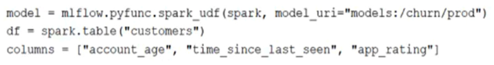

The data science team has created and logged a production model using MLflow. The model accepts a list of column names and returns a new column of type DOUBLE.The following code correctly imports the production model, loads the customers table containing the customer_id key column into a DataFrame, and defines the feature columns needed for the model.Which code block will output a DataFrame with the schema "customer_id LONG, predictions DOUBLE"?

- A.df.map(lambda x:model(x[columns])).select("customer_id, predictions")
- B.df.select("customer_id", model(*columns).alias("predictions"))
- C.model.predict(df, columns)
- D.df.select("customer_id", pandas_udf(model, columns).alias("predictions"))
- E.df.apply(model, columns).select("customer_id, predictions")

---

### Question 106

A nightly batch job is configured to ingest all data files from a cloud object storage container where records are stored in a nested directory structure YYYY/MM/DD. The data for each date represents all records that were processed by the source system on that date, noting that some records may be delayed as they await moderator approval. Each entry represents a user review of a product and has the following schema:user_id STRING, review_id BIGINT, product_id BIGINT, review_timestamp TIMESTAMP, review_text STRINGThe ingestion job is configured to append all data for the previous date to a target table reviews_raw with an identical schema to the source system. The next step in the pipeline is a batch write to propagate all new records inserted into reviews_raw to a table where data is fully deduplicated, validated, and enriched.Which solution minimizes the compute costs to propagate this batch of data?

- A.Perform a batch read on the reviews_raw table and perform an insert-only merge using the natural composite key user_id, review_id, product_id, review_timestamp.
- B.Configure a Structured Streaming read against the reviews_raw table using the trigger once execution mode to process new records as a batch job.
- C.Use Delta Lake version history to get the difference between the latest version of reviews_raw and one version prior, then write these records to the next table.
- D.Filter all records in the reviews_raw table based on the review_timestamp; batch append those records produced in the last 48 hours.
- E.Reprocess all records in reviews_raw and overwrite the next table in the pipeline.

---

### Question 107

Which statement describes Delta Lake optimized writes?

- A.Before a Jobs cluster terminates, OPTIMIZE is executed on all tables modified during the most recent job.
- B.An asynchronous job runs after the write completes to detect if files could be further compacted; if yes, an OPTIMIZE job is executed toward a default of 1 GB.
- C.Data is queued in a messaging bus instead of committing data directly to memory; all data is committed from the messaging bus in one batch once the job is complete.
- D.Optimized writes use logical partitions instead of directory partitions; because partition boundaries are only represented in metadata, fewer small files are written.
- E.A shuffle occurs prior to writing to try to group similar data together resulting in fewer files instead of each executor writing multiple files based on directory partitions.

---

### Question 108

Which statement describes the default execution mode for Databricks Auto Loader?

- A.Cloud vendor-specific queue storage and notification services are configured to track newly arriving files; the target table is materialized by directly querying all valid files in the source directory.
- B.New files are identified by listing the input directory; the target table is materialized by directly querying all valid files in the source directory.
- C.Webhooks trigger a Databricks job to run anytime new data arrives in a source directory; new data are automatically merged into target tables using rules inferred from the data.
- D.New files are identified by listing the input directory; new files are incrementally and idempotently loaded into the target Delta Lake table.
- E.Cloud vendor-specific queue storage and notification services are configured to track newly arriving files; new files are incrementally and idempotently loaded into the target Delta Lake table.

---

### Question 109

A Delta Lake table representing metadata about content posts from users has the following schema:user_id LONG, post_text STRING, post_id STRING, longitude FLOAT, latitude FLOAT, post_time TIMESTAMP, date DATEBased on the above schema, which column is a good candidate for partitioning the Delta Table?

- A.post_time
- B.latitude
- C.post_id
- D.user_id
- E.date

---

### Question 110

A large company seeks to implement a near real-time solution involving hundreds of pipelines with parallel updates of many tables with extremely high volume and high velocity data.Which of the following solutions would you implement to achieve this requirement?

- A.Use Databricks High Concurrency clusters, which leverage optimized cloud storage connections to maximize data throughput.
- B.Partition ingestion tables by a small time duration to allow for many data files to be written in parallel.
- C.Configure Databricks to save all data to attached SSD volumes instead of object storage, increasing file I/O significantly.
- D.Isolate Delta Lake tables in their own storage containers to avoid API limits imposed by cloud vendors.
- E.Store all tables in a single database to ensure that the Databricks Catalyst Metastore can load balance overall throughput.

---

### Question 111

Which describes a method of installing a Python package scoped at the notebook level to all nodes in the currently active cluster?

- A.Run source env/bin/activate in a notebook setup script
- B.Use b in a notebook cell
- C.Use %pip install in a notebook cell
- D.Use %sh pip install in a notebook cell
- E.Install libraries from PyPI using the cluster UI

---

### Question 112

Each configuration below is identical to the extent that each cluster has 400 GB total of RAM 160 total cores and only one Executor per VM.Given an extremely long-running job for which completion must be guaranteed, which cluster configuration will be able to guarantee completion of the job in light of one or more VM failures?

- A.• Total VMs: 8• 50 GB per Executor• 20 Cores / Executor
- B.• Total VMs: 16• 25 GB per Executor• 10 Cores / Executor
- C.• Total VMs: 1• 400 GB per Executor• 160 Cores/Executor
- D.• Total VMs: 4• 100 GB per Executor• 40 Cores / Executor
- E.• Total VMs: 2• 200 GB per Executor• 80 Cores / Executor

---

### Question 113

A Delta Lake table in the Lakehouse named customer_churn_params is used in churn prediction by the machine learning team. The table contains information about customers derived from a number of upstream sources. Currently, the data engineering team populates this table nightly by overwriting the table with the current valid values derived from upstream data sources.Immediately after each update succeeds, the data engineering team would like to determine the difference between the new version and the previous version of the table.Given the current implementation, which method can be used?

- A.Execute a query to calculate the difference between the new version and the previous version using Delta Lake’s built-in versioning and lime travel functionality.
- B.Parse the Delta Lake transaction log to identify all newly written data files.
- C.Parse the Spark event logs to identify those rows that were updated, inserted, or deleted.
- D.Execute DESCRIBE HISTORY customer_churn_params to obtain the full operation metrics for the update, including a log of all records that have been added or modified.
- E.Use Delta Lake’s change data feed to identify those records that have been updated, inserted, or deleted.

---

### Question 114

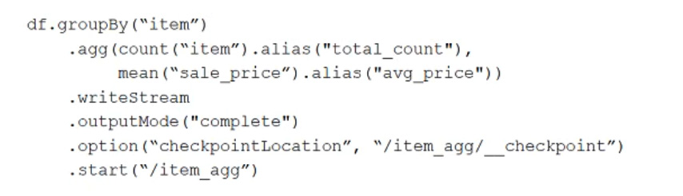

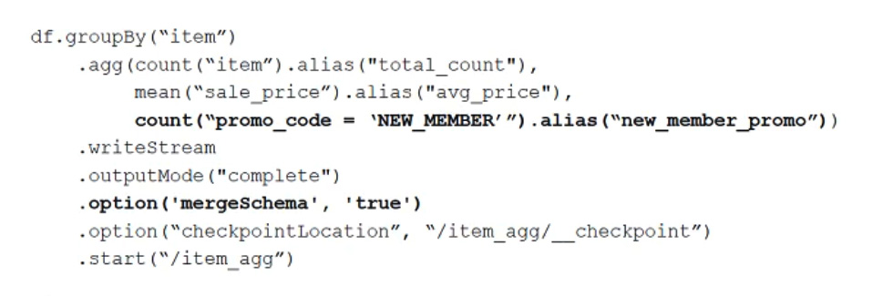

A data team’s Structured Streaming job is configured to calculate running aggregates for item sales to update a downstream marketing dashboard. The marketing team has introduced a new promotion, and they would like to add a new field to track the number of times this promotion code is used for each item. A junior data engineer suggests updating the existing query as follows. Note that proposed changes are in bold.Original query:Proposed query:Which step must also be completed to put the proposed query into production?

- A.Specify a new checkpointLocation
- B.Remove .option('mergeSchema', 'true') from the streaming write
- C.Increase the shuffle partitions to account for additional aggregates
- D.Run REFRESH TABLE delta.‛/item_agg‛

---

### Question 115

When using CLI or REST API to get results from jobs with multiple tasks, which statement correctly describes the response structure?

- A.Each run of a job will have a unique job_id; all tasks within this job will have a unique job_id
- B.Each run of a job will have a unique job_id; all tasks within this job will have a unique task_id
- C.Each run of a job will have a unique orchestration_id; all tasks within this job will have a unique run_id
- D.Each run of a job will have a unique run_id; all tasks within this job will have a unique task_id
- E.Each run of a job will have a unique run_id; all tasks within this job will also have a unique run_id

---

### Question 116

The data engineering team is configuring environments for development, testing, and production before beginning migration on a new data pipeline. The team requires extensive testing on both the code and data resulting from code execution, and the team wants to develop and test against data as similar to production data as possible.A junior data engineer suggests that production data can be mounted to the development and testing environments, allowing pre-production code to execute against production data. Because all users have admin privileges in the development environment, the junior data engineer has offered to configure permissions and mount this data for the team.Which statement captures best practices for this situation?

- A.All development, testing, and production code and data should exist in a single, unified workspace; creating separate environments for testing and development complicates administrative overhead.
- B.In environments where interactive code will be executed, production data should only be accessible with read permissions; creating isolated databases for each environment further reduces risks.
- C.As long as code in the development environment declares USE dev_db at the top of each notebook, there is no possibility of inadvertently committing changes back to production data sources.
- D.Because Delta Lake versions all data and supports time travel, it is not possible for user error or malicious actors to permanently delete production data; as such, it is generally safe to mount production data anywhere.
- E.Because access to production data will always be verified using passthrough credentials, it is safe to mount data to any Databricks development environment.

---

### Question 117

A data engineer, User A, has promoted a pipeline to production by using the REST API to programmatically create several jobs. A DevOps engineer, User B, has configured an external orchestration tool to trigger job runs through the REST API. Both users authorized the REST API calls using their personal access tokens.A workspace admin, User C, inherits responsibility for managing this pipeline. User C uses the Databricks Jobs UI to take "Owner" privileges of each job. Jobs continue to be triggered using the credentials and tooling configured by User B.An application has been configured to collect and parse run information returned by the REST API. Which statement describes the value returned in the creator_user_name field?

- A.Once User C takes "Owner" privileges, their email address will appear in this field; prior to this, User A’s email address will appear in this field.
- B.User B’s email address will always appear in this field, as their credentials are always used to trigger the run.
- C.User A’s email address will always appear in this field, as they still own the underlying notebooks.
- D.Once User C takes "Owner" privileges, their email address will appear in this field; prior to this, User B’s email address will appear in this field.
- E.User C will only ever appear in this field if they manually trigger the job, otherwise it will indicate User B.

---

### Question 118

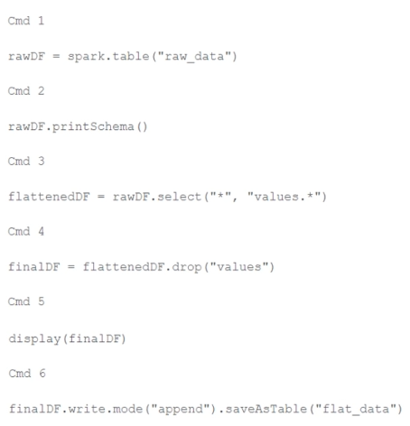

A member of the data engineering team has submitted a short notebook that they wish to schedule as part of a larger data pipeline. Assume that the commands provided below produce the logically correct results when run as presented.Which command should be removed from the notebook before scheduling it as a job?

- A.Cmd 2
- B.Cmd 3
- C.Cmd 4
- D.Cmd 5

---

### Question 119

Which statement regarding Spark configuration on the Databricks platform is true?

- A.The Databricks REST API can be used to modify the Spark configuration properties for an interactive cluster without interrupting jobs currently running on the cluster.
- B.Spark configurations set within a notebook will affect all SparkSessions attached to the same interactive cluster.
- C.When the same Spark configuration property is set for an interactive cluster and a notebook attached to that cluster, the notebook setting will always be ignored.
- D.Spark configuration properties set for an interactive cluster with the Clusters UI will impact all notebooks attached to that cluster.

---

### Question 120

The business reporting team requires that data for their dashboards be updated every hour. The total processing time for the pipeline that extracts, transforms, and loads the data for their pipeline runs in 10 minutes.Assuming normal operating conditions, which configuration will meet their service-level agreement requirements with the lowest cost?

- A.Configure a job that executes every time new data lands in a given directory
- B.Schedule a job to execute the pipeline once an hour on a new job cluster
- C.Schedule a Structured Streaming job with a trigger interval of 60 minutes
- D.Schedule a job to execute the pipeline once an hour on a dedicated interactive cluster

---

### Question 121

A Databricks SQL dashboard has been configured to monitor the total number of records present in a collection of Delta Lake tables using the following query pattern:SELECT COUNT (*) FROM table -Which of the following describes how results are generated each time the dashboard is updated?

- A.The total count of rows is calculated by scanning all data files
- B.The total count of rows will be returned from cached results unless REFRESH is run
- C.The total count of records is calculated from the Delta transaction logs
- D.The total count of records is calculated from the parquet file metadata

---

### Question 122

A Delta Lake table was created with the below query:Consider the following query:DROP TABLE prod.sales_by_store -If this statement is executed by a workspace admin, which result will occur?

- A.Data will be marked as deleted but still recoverable with Time Travel.
- B.The table will be removed from the catalog but the data will remain in storage.
- C.The table will be removed from the catalog and the data will be deleted.
- D.An error will occur because Delta Lake prevents the deletion of production data.

---

### Question 123

A developer has successfully configured their credentials for Databricks Repos and cloned a remote Git repository. They do not have privileges to make changes to the main branch, which is the only branch currently visible in their workspace.Which approach allows this user to share their code updates without the risk of overwriting the work of their teammates?

- A.Use Repos to create a new branch, commit all changes, and push changes to the remote Git repository.
- B.Use Repos to create a fork of the remote repository, commit all changes, and make a pull request on the source repository.
- C.Use Repos to pull changes from the remote Git repository; commit and push changes to a branch that appeared as changes were pulled.
- D.Use Repos to merge all differences and make a pull request back to the remote repository.

---

### Question 124

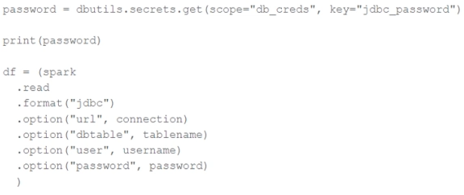

The security team is exploring whether or not the Databricks secrets module can be leveraged for connecting to an external database.After testing the code with all Python variables being defined with strings, they upload the password to the secrets module and configure the correct permissions for the currently active user. They then modify their code to the following (leaving all other variables unchanged).Which statement describes what will happen when the above code is executed?

- A.The connection to the external table will succeed; the string "REDACTED" will be printed.
- B.An interactive input box will appear in the notebook; if the right password is provided, the connection will succeed and the encoded password will be saved to DBFS.
- C.An interactive input box will appear in the notebook; if the right password is provided, the connection will succeed and the password will be printed in plain text.
- D.The connection to the external table will succeed; the string value of password will be printed in plain text.

---

### Question 125

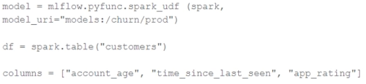

The data science team has created and logged a production model using MLflow. The model accepts a list of column names and returns a new column of type DOUBLE.The following code correctly imports the production model, loads the customers table containing the customer_id key column into a DataFrame, and defines the feature columns needed for the model.Which code block will output a DataFrame with the schema "customer_id LONG, predictions DOUBLE"?

- A.df.map(lambda x:model(x[columns])).select("customer_id, predictions")
- B.df.select("customer_id",model(*columns).alias("predictions"))
- C.model.predict(df, columns)
- D.df.apply(model, columns).select("customer_id, predictions")

---

### Question 126

A junior member of the data engineering team is exploring the language interoperability of Databricks notebooks. The intended outcome of the below code is to register a view of all sales that occurred in countries on the continent of Africa that appear in the geo_lookup table.Before executing the code, running SHOW TABLES on the current database indicates the database contains only two tables: geo_lookup and sales.What will be the outcome of executing these command cells m order m an interactive notebook?

- A.Both commands will succeed. Executing SHOW TABLES will show that countries_af and sales_af have been registered as views.
- B.Cmd 1 will succeed. Cmd 2 will search all accessible databases for a table or view named countries_af: if this entity exists, Cmd 2 will succeed.
- C.Cmd 1 will succeed and Cmd 2 will fail. countries_af will be a Python variable representing a PySpark DataFrame.
- D.Cmd 1 will succeed and Cmd 2 will fail. countries_af will be a Python variable containing a list of strings.

---

### Question 127

The data science team has requested assistance in accelerating queries on free-form text from user reviews. The data is currently stored in Parquet with the below schema:item_id INT, user_id INT, review_id INT, rating FLOAT, review STRINGThe review column contains the full text of the review left by the user. Specifically, the data science team is looking to identify if any of 30 key words exist in this field.A junior data engineer suggests converting this data to Delta Lake will improve query performance.Which response to the junior data engineer’s suggestion is correct?

- A.Delta Lake statistics are not optimized for free text fields with high cardinality.
- B.Delta Lake statistics are only collected on the first 4 columns in a table.
- C.ZORDER ON review will need to be run to see performance gains.
- D.The Delta log creates a term matrix for free text fields to support selective filtering.

---

### Question 128

The data engineering team has configured a job to process customer requests to be forgotten (have their data deleted). All user data that needs to be deleted is stored in Delta Lake tables using default table settings.The team has decided to process all deletions from the previous week as a batch job at 1am each Sunday. The total duration of this job is less than one hour. Every Monday at 3am, a batch job executes a series of VACUUM commands on all Delta Lake tables throughout the organization.The compliance officer has recently learned about Delta Lake's time travel functionality. They are concerned that this might allow continued access to deleted data.Assuming all delete logic is correctly implemented, which statement correctly addresses this concern?

- A.Because the VACUUM command permanently deletes all files containing deleted records, deleted records may be accessible with time travel for around 24 hours.
- B.Because the default data retention threshold is 24 hours, data files containing deleted records will be retained until the VACUUM job is run the following day.
- C.Because the default data retention threshold is 7 days, data files containing deleted records will be retained until the VACUUM job is run 8 days later.
- D.Because Delta Lake's delete statements have ACID guarantees, deleted records will be permanently purged from all storage systems as soon as a delete job completes.

---

### Question 129

Assuming that the Databricks CLI has been installed and configured correctly, which Databricks CLI command can be used to upload a custom Python Wheel to object storage mounted with the DBFS for use with a production job?

- A.configure
- B.fs
- C.workspace
- D.libraries

---

### Question 130

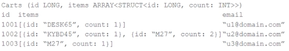

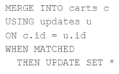

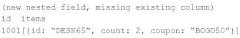

The following table consists of items found in user carts within an e-commerce website.The following MERGE statement is used to update this table using an updates view, with schema evolution enabled on this table.How would the following update be handled?

- A.The update throws an error because changes to existing columns in the target schema are not supported.
- B.The new nested Field is added to the target schema, and dynamically read as NULL for existing unmatched records.
- C.The update is moved to a separate "rescued" column because it is missing a column expected in the target schema.
- D.The new nested field is added to the target schema, and files underlying existing records are updated to include NULL values for the new field.

---

### Question 131

A data engineer has been using a Databricks SQL dashboard to monitor the cleanliness of the input data to an ELT job. The ELT job has its Databricks SQL query that returns the number of input records containing unexpected NULL values. The data engineer wants their entire team to be notified via a messaging webhook whenever this value reaches 100.Which approach can the data engineer use to notify their entire team via a messaging webhook whenever the number of NULL values reaches 100?

- A.They can set up an Alert with a custom template.
- B.They can set up an Alert with a new email alert destination.
- C.They can set up an Alert with a new webhook alert destination.
- D.They can set up an Alert with one-time notifications.

---

### Question 132

An hourly batch job is configured to ingest data files from a cloud object storage container where each batch represent all records produced by the source system in a given hour. The batch job to process these records into the Lakehouse is sufficiently delayed to ensure no late-arriving data is missed. The user_id field represents a unique key for the data, which has the following schema:user_id BIGINT, username STRING, user_utc STRING, user_region STRING, last_login BIGINT, auto_pay BOOLEAN, last_updated BIGINTNew records are all ingested into a table named account_history which maintains a full record of all data in the same schema as the source. The next table in the system is named account_current and is implemented as a Type 1 table representing the most recent value for each unique user_id.Which implementation can be used to efficiently update the described account_current table as part of each hourly batch job assuming there are millions of user accounts and tens of thousands of records processed hourly?

- A.Filter records in account_history using the last_updated field and the most recent hour processed, making sure to deduplicate on username; write a merge statement to update or insert the most recent value for each username.
- B.Use Auto Loader to subscribe to new files in the account_history directory; configure a Structured Streaming trigger available job to batch update newly detected files into the account_current table.
- C.Overwrite the account_current table with each batch using the results of a query against the account_history table grouping by user_id and filtering for the max value of last_updated.
- D.Filter records in account_history using the last_updated field and the most recent hour processed, as well as the max last_login by user_id write a merge statement to update or insert the most recent value for each user_id.

---

### Question 133

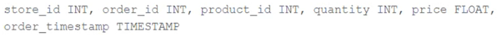

The business intelligence team has a dashboard configured to track various summary metrics for retail stores. This includes total sales for the previous day alongside totals and averages for a variety of time periods. The fields required to populate this dashboard have the following schema:For demand forecasting, the Lakehouse contains a validated table of all itemized sales updated incrementally in near real-time. This table, named products_per_order, includes the following fields:Because reporting on long-term sales trends is less volatile, analysts using the new dashboard only require data to be refreshed once daily. Because the dashboard will be queried interactively by many users throughout a normal business day, it should return results quickly and reduce total compute associated with each materialization.Which solution meets the expectations of the end users while controlling and limiting possible costs?

- A.Populate the dashboard by configuring a nightly batch job to save the required values as a table overwritten with each update.
- B.Use Structured Streaming to configure a live dashboard against the products_per_order table within a Databricks notebook.
- C.Define a view against the products_per_order table and define the dashboard against this view.
- D.Use the Delta Cache to persist the products_per_order table in memory to quickly update the dashboard with each query.

---

### Question 134

A Delta lake table with CDF enabled table in the Lakehouse named customer_churn_params is used in churn prediction by the machine learning team. The table contains information about customers derived from a number of upstream sources. Currently, the data engineering team populates this table nightly by overwriting the table with the current valid values derived from upstream data sources.The churn prediction model used by the ML team is fairly stable in production. The team is only interested in making predictions on records that have changed in the past 24 hours.Which approach would simplify the identification of these changed records?

- A.Apply the churn model to all rows in the customer_churn_params table, but implement logic to perform an upsert into the predictions table that ignores rows where predictions have not changed.
- B.Convert the batch job to a Structured Streaming job using the complete output mode; configure a Structured Streaming job to read from the customer_churn_params table and incrementally predict against the churn model.
- C.Replace the current overwrite logic with a merge statement to modify only those records that have changed; write logic to make predictions on the changed records identified by the change data feed.
- D.Modify the overwrite logic to include a field populated by calling spark.sql.functions.current_timestamp() as data are being written; use this field to identify records written on a particular date.

---

### Question 135

A view is registered with the following code:Both users and orders are Delta Lake tables.Which statement describes the results of querying recent_orders?

- A.All logic will execute when the view is defined and store the result of joining tables to the DBFS; this stored data will be returned when the view is queried.
- B.Results will be computed and cached when the view is defined; these cached results will incrementally update as new records are inserted into source tables.
- C.All logic will execute at query time and return the result of joining the valid versions of the source tables at the time the query finishes.
- D.All logic will execute at query time and return the result of joining the valid versions of the source tables at the time the query began.

---

### Question 136

A data ingestion task requires a one-TB JSON dataset to be written out to Parquet with a target part-file size of 512 MB. Because Parquet is being used instead of Delta Lake, built-in file-sizing features such as Auto-Optimize & Auto-Compaction cannot be used.Which strategy will yield the best performance without shuffling data?

- A.Set spark.sql.files.maxPartitionBytes to 512 MB, ingest the data, execute the narrow transformations, and then write to parquet.
- B.Set spark.sql.shuffle.partitions to 2,048 partitions (1TB*1024*1024/512), ingest the data, execute the narrow transformations, optimize the data by sorting it (which automatically repartitions the data), and then write to parquet.
- C.Set spark.sql.adaptive.advisoryPartitionSizeInBytes to 512 MB bytes, ingest the data, execute the narrow transformations, coalesce to 2,048 partitions (1TB*1024*1024/512), and then write to parquet.
- D.Ingest the data, execute the narrow transformations, repartition to 2,048 partitions (1TB* 1024*1024/512), and then write to parquet.

---

### Question 137

Identify how the count_if function and the count where x is null can be usedConsider a table random_values with below data.What would be the output of below query?select count_if(col > 1) as count_a. count(*) as count_b.count(col1) as count_c from random_values col1012NULL -23

- A.3 6 5
- B.4 6 5
- C.3 6 6
- D.4 6 6

---

### Question 138

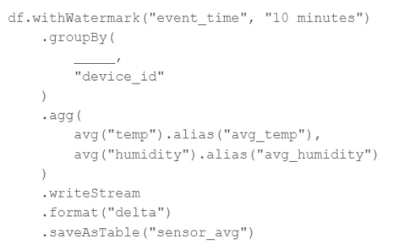

A junior data engineer has been asked to develop a streaming data pipeline with a grouped aggregation using DataFrame df. The pipeline needs to calculate the average humidity and average temperature for each non-overlapping five-minute interval. Events are recorded once per minute per device.Streaming DataFrame df has the following schema:"device_id INT, event_time TIMESTAMP, temp FLOAT, humidity FLOAT"Code block:Which line of code correctly fills in the blank within the code block to complete this task?

- A.to_interval("event_time", "5 minutes").alias("time")
- B.window("event_time", "5 minutes").alias("time")
- C."event_time"
- D.lag("event_time", "10 minutes").alias("time")

---

### Question 139

A Structured Streaming job deployed to production has been resulting in higher than expected cloud storage costs. At present, during normal execution, each microbatch of data is processed in less than 3s; at least 12 times per minute, a microbatch is processed that contains 0 records. The streaming write was configured using the default trigger settings. The production job is currently scheduled alongside many other Databricks jobs in a workspace with instance pools provisioned to reduce start-up time for jobs with batch execution.Holding all other variables constant and assuming records need to be processed in less than 10 minutes, which adjustment will meet the requirement?

- A.Set the trigger interval to 3 seconds; the default trigger interval is consuming too many records per batch, resulting in spill to disk that can increase volume costs.
- B.Use the trigger once option and configure a Databricks job to execute the query every 10 minutes; this approach minimizes costs for both compute and storage.
- C.Set the trigger interval to 10 minutes; each batch calls APIs in the source storage account, so decreasing trigger frequency to maximum allowable threshold should minimize this cost.
- D.Set the trigger interval to 500 milliseconds; setting a small but non-zero trigger interval ensures that the source is not queried too frequently.

---

### Question 140

Which statement describes Delta Lake optimized writes?

- A.Before a Jobs cluster terminates, OPTIMIZE is executed on all tables modified during the most recent job.
- B.An asynchronous job runs after the write completes to detect if files could be further compacted; if yes, an OPTIMIZE job is executed toward a default of 1 GB.
- C.A shuffle occurs prior to writing to try to group similar data together resulting in fewer files instead of each executor writing multiple files based on directory partitions.
- D.Optimized writes use logical partitions instead of directory partitions; because partition boundaries are only represented in metadata, fewer small files are written.

---

### Question 141

Which statement characterizes the general programming model used by Spark Structured Streaming?

- A.Structured Streaming leverages the parallel processing of GPUs to achieve highly parallel data throughput.
- B.Structured Streaming is implemented as a messaging bus and is derived from Apache Kafka.
- C.Structured Streaming relies on a distributed network of nodes that hold incremental state values for cached stages.
- D.Structured Streaming models new data arriving in a data stream as new rows appended to an unbounded table.

---

### Question 142

Which configuration parameter directly affects the size of a spark-partition upon ingestion of data into Spark?

- A.spark.sql.files.maxPartitionBytes
- B.spark.sql.autoBroadcastJoinThreshold
- C.spark.sql.adaptive.advisoryPartitionSizeInBytes
- D.spark.sql.adaptive.coalescePartitions.minPartitionNum

---

### Question 143

A Spark job is taking longer than expected. Using the Spark UI, a data engineer notes that the Min, Median, and Max Durations for tasks in a particular stage show the minimum and median time to complete a task as roughly the same, but the max duration for a task to be roughly 100 times as long as the minimum.Which situation is causing increased duration of the overall job?

- A.Task queueing resulting from improper thread pool assignment.
- B.Spill resulting from attached volume storage being too small.
- C.Network latency due to some cluster nodes being in different regions from the source data
- D.Skew caused by more data being assigned to a subset of spark-partitions.

---

### Question 144

Each configuration below is identical to the extent that each cluster has 400 GB total of RAM, 160 total cores and only one Executor per VM.Given an extremely long-running job for which completion must be guaranteed, which cluster configuration will be able to guarantee completion of the job in light of one or more VM failures?

- A.• Total VMs: 8• 50 GB per Executor• 20 Cores / Executor
- B.• Total VMs: 16• 25 GB per Executor• 10 Cores / Executor
- C.• Total VMs: 1• 400 GB per Executor• 160 Cores/Executor
- D.• Total VMs: 4• 100 GB per Executor• 40 Cores / Executor

---

### Question 145

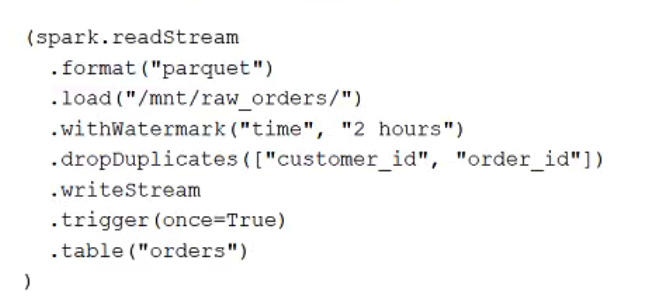

A task orchestrator has been configured to run two hourly tasks. First, an outside system writes Parquet data to a directory mounted at /mnt/raw_orders/. After this data is written, a Databricks job containing the following code is executed:Assume that the fields customer_id and order_id serve as a composite key to uniquely identify each order, and that the time field indicates when the record was queued in the source system.If the upstream system is known to occasionally enqueue duplicate entries for a single order hours apart, which statement is correct?

- A.Duplicate records enqueued more than 2 hours apart may be retained and the orders table may contain duplicate records with the same customer_id and order_id.
- B.All records will be held in the state store for 2 hours before being deduplicated and committed to the orders table.
- C.The orders table will contain only the most recent 2 hours of records and no duplicates will be present.
- D.The orders table will not contain duplicates, but records arriving more than 2 hours late will be ignored and missing from the table.

---

### Question 146

A data engineer is configuring a pipeline that will potentially see late-arriving, duplicate records.In addition to de-duplicating records within the batch, which of the following approaches allows the data engineer to deduplicate data against previously processed records as it is inserted into a Delta table?

- A.Rely on Delta Lake schema enforcement to prevent duplicate records.
- B.VACUUM the Delta table after each batch completes.
- C.Perform an insert-only merge with a matching condition on a unique key.
- D.Perform a full outer join on a unique key and overwrite existing data.

---

### Question 147

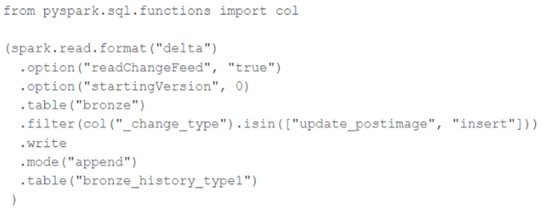

A junior data engineer seeks to leverage Delta Lake's Change Data Feed functionality to create a Type 1 table representing all of the values that have ever been valid for all rows in a bronze table created with the property delta.enableChangeDataFeed = true. They plan to execute the following code as a daily job:Which statement describes the execution and results of running the above query multiple times?

- A.Each time the job is executed, newly updated records will be merged into the target table, overwriting previous values with the same primary keys.
- B.Each time the job is executed, the entire available history of inserted or updated records will be appended to the target table, resulting in many duplicate entries.
- C.Each time the job is executed, only those records that have been inserted or updated since the last execution will be appended to the target table, giving the desired result.
- D.Each time the job is executed, the differences between the original and current versions are calculated; this may result in duplicate entries for some records.

---

### Question 148

A DLT pipeline includes the following streaming tables:•	raw_iot ingests raw device measurement data from a heart rate tracking device.•	bpm_stats incrementally computes user statistics based on BPM measurements from raw_iot.How can the data engineer configure this pipeline to be able to retain manually deleted or updated records in the raw_iot table, while recomputing the downstream table bpm_stats table when a pipeline update is run?

- A.Set the pipelines.reset.allowed property to false on raw_iot
- B.Set the skipChangeCommits flag to true on raw_iot
- C.Set the pipelines.reset.allowed property to false on bpm_stats
- D.Set the skipChangeCommits flag to true on bpm_stats

---

### Question 149

A data pipeline uses Structured Streaming to ingest data from Apache Kafka to Delta Lake. Data is being stored in a bronze table, and includes the Kafka-generated timestamp, key, and value. Three months after the pipeline is deployed, the data engineering team has noticed some latency issues during certain times of the day.A senior data engineer updates the Delta Table's schema and ingestion logic to include the current timestamp (as recorded by Apache Spark) as well as the Kafka topic and partition. The team plans to use these additional metadata fields to diagnose the transient processing delays.Which limitation will the team face while diagnosing this problem?

- A.New fields will not be computed for historic records.
- B.Spark cannot capture the topic and partition fields from a Kafka source.
- C.Updating the table schema requires a default value provided for each field added.
- D.Updating the table schema will invalidate the Delta transaction log metadata.

---

### Question 150

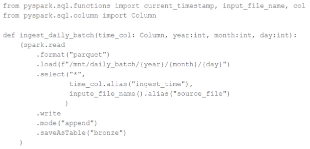

A nightly job ingests data into a Delta Lake table using the following code:The next step in the pipeline requires a function that returns an object that can be used to manipulate new records that have not yet been processed to the next table in the pipeline.Which code snippet completes this function definition?def new_records():

- A.return spark.readStream.table("bronze")
- B.return spark.read.option("readChangeFeed", "true").table ("bronze")
- C.
- D.
- 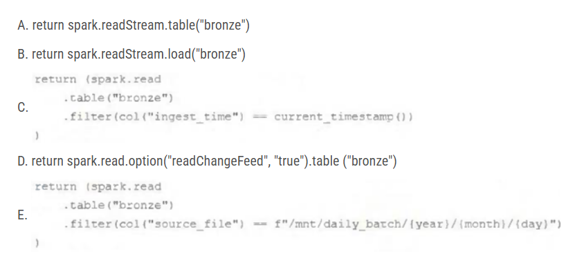

---

### Question 151

A junior data engineer is working to implement logic for a Lakehouse table named silver_device_recordings. The source data contains 100 unique fields in a highly nested JSON structure.The silver_device_recordings table will be used downstream to power several production monitoring dashboards and a production model. At present, 45 of the 100 fields are being used in at least one of these applications.The data engineer is trying to determine the best approach for dealing with schema declaration given the highly-nested structure of the data and the numerous fields.Which of the following accurately presents information about Delta Lake and Databricks that may impact their decision-making process?

- A.The Tungsten encoding used by Databricks is optimized for storing string data; newly-added native support for querying JSON strings means that string types are always most efficient.
- B.Because Delta Lake uses Parquet for data storage, data types can be easily evolved by just modifying file footer information in place.
- C.Schema inference and evolution on Databricks ensure that inferred types will always accurately match the data types used by downstream systems.
- D.Because Databricks will infer schema using types that allow all observed data to be processed, setting types manually provides greater assurance of data quality enforcement.

---

### Question 152

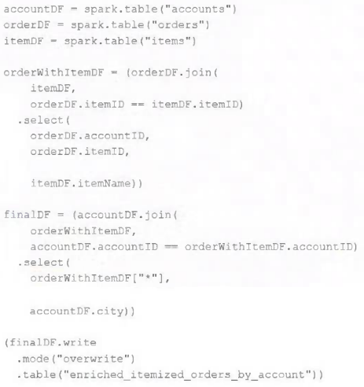

The data engineering team maintains the following code:Assuming that this code produces logically correct results and the data in the source tables has been de-duplicated and validated, which statement describes what will occur when this code is executed?

- A.A batch job will update the enriched_itemized_orders_by_account table, replacing only those rows that have different values than the current version of the table, using accountID as the primary key.
- B.The enriched_itemized_orders_by_account table will be overwritten using the current valid version of data in each of the three tables referenced in the join logic.
- C.No computation will occur until enriched_itemized_orders_by_account is queried; upon query materialization, results will be calculated using the current valid version of data in each of the three tables referenced in the join logic.
- D.An incremental job will detect if new rows have been written to any of the source tables; if new rows are detected, all results will be recalculated and used to overwrite the enriched_itemized_orders_by_account table.

---

### Question 153

The data engineering team is configuring environments for development, testing, and production before beginning migration on a new data pipeline. The team requires extensive testing on both the code and data resulting from code execution, and the team wants to develop and test against data as similar to production data as possible.A junior data engineer suggests that production data can be mounted to the development and testing environments, allowing pre-production code to execute against production data. Because all users have admin privileges in the development environment, the junior data engineer has offered to configure permissions and mount this data for the team.Which statement captures best practices for this situation?

- A.All development, testing, and production code and data should exist in a single, unified workspace; creating separate environments for testing and development complicates administrative overhead.
- B.In environments where interactive code will be executed, production data should only be accessible with read permissions; creating isolated databases for each environment further reduces risks.
- C.Because access to production data will always be verified using passthrough credentials, it is safe to mount data to any Databricks development environment.
- D.Because Delta Lake versions all data and supports time travel, it is not possible for user error or malicious actors to permanently delete production data; as such, it is generally safe to mount production data anywhere.

---

### Question 154

The data architect has mandated that all tables in the Lakehouse should be configured as external Delta Lake tables.Which approach will ensure that this requirement is met?

- A.Whenever a database is being created, make sure that the LOCATION keyword is used.
- B.When the workspace is being configured, make sure that external cloud object storage has been mounted.
- C.Whenever a table is being created, make sure that the LOCATION keyword is used.
- D.When tables are created, make sure that the UNMANAGED keyword is used in the CREATE TABLE statement.

---

### Question 155

The marketing team is looking to share data in an aggregate table with the sales organization, but the field names used by the teams do not match, and a number of marketing-specific fields have not been approved for the sales org.Which of the following solutions addresses the situation while emphasizing simplicity?

- A.Create a view on the marketing table selecting only those fields approved for the sales team; alias the names of any fields that should be standardized to the sales naming conventions.
- B.Create a new table with the required schema and use Delta Lake's DEEP CLONE functionality to sync up changes committed to one table to the corresponding table.
- C.Use a CTAS statement to create a derivative table from the marketing table; configure a production job to propagate changes.
- D.Add a parallel table write to the current production pipeline, updating a new sales table that varies as required from the marketing table.

---

### Question 156

A Delta Lake table representing metadata about content posts from users has the following schema:user_id LONG, post_text STRING, post_id STRING, longitude FLOAT, latitude FLOAT, post_time TIMESTAMP, date DATEThis table is partitioned by the date column. A query is run with the following filter:longitude < 20 & longitude > -20Which statement describes how data will be filtered?

- A.Statistics in the Delta Log will be used to identify partitions that might Include files in the filtered range.
- B.No file skipping will occur because the optimizer does not know the relationship between the partition column and the longitude.
- C.The Delta Engine will scan the parquet file footers to identify each row that meets the filter criteria.
- D.Statistics in the Delta Log will be used to identify data files that might include records in the filtered range.

---

### Question 157

A small company based in the United States has recently contracted a consulting firm in India to implement several new data engineering pipelines to power artificial intelligence applications. All the company's data is stored in regional cloud storage in the United States.The workspace administrator at the company is uncertain about where the Databricks workspace used by the contractors should be deployed.Assuming that all data governance considerations are accounted for, which statement accurately informs this decision?

- A.Databricks runs HDFS on cloud volume storage; as such, cloud virtual machines must be deployed in the region where the data is stored.
- B.Databricks workspaces do not rely on any regional infrastructure; as such, the decision should be made based upon what is most convenient for the workspace administrator.
- C.Cross-region reads and writes can incur significant costs and latency; whenever possible, compute should be deployed in the same region the data is stored.
- D.Databricks notebooks send all executable code from the user’s browser to virtual machines over the open internet; whenever possible, choosing a workspace region near the end users is the most secure.

---

### Question 158

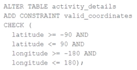

A CHECK constraint has been successfully added to the Delta table named activity_details using the following logic:A batch job is attempting to insert new records to the table, including a record where latitude = 45.50 and longitude = 212.67.Which statement describes the outcome of this batch insert?

- A.The write will insert all records except those that violate the table constraints; the violating records will be reported in a warning log.
- B.The write will fail completely because of the constraint violation and no records will be inserted into the target table.
- C.The write will insert all records except those that violate the table constraints; the violating records will be recorded to a quarantine table.
- D.The write will include all records in the target table; any violations will be indicated in the boolean column named valid_coordinates.

---

### Question 159

A junior data engineer is migrating a workload from a relational database system to the Databricks Lakehouse. The source system uses a star schema, leveraging foreign key constraints and multi-table inserts to validate records on write.Which consideration will impact the decisions made by the engineer while migrating this workload?

- A.Databricks only allows foreign key constraints on hashed identifiers, which avoid collisions in highly-parallel writes.
- B.Foreign keys must reference a primary key field; multi-table inserts must leverage Delta Lake’s upsert functionality.
- C.Committing to multiple tables simultaneously requires taking out multiple table locks and can lead to a state of deadlock.
- D.All Delta Lake transactions are ACID compliant against a single table, and Databricks does not enforce foreign key constraints.

---

### Question 160

A data architect has heard about Delta Lake’s built-in versioning and time travel capabilities. For auditing purposes, they have a requirement to maintain a full record of all valid street addresses as they appear in the customers table.The architect is interested in implementing a Type 1 table, overwriting existing records with new values and relying on Delta Lake time travel to support long-term auditing. A data engineer on the project feels that a Type 2 table will provide better performance and scalability.Which piece of information is critical to this decision?

- A.Data corruption can occur if a query fails in a partially completed state because Type 2 tables require setting multiple fields in a single update.
- B.Shallow clones can be combined with Type 1 tables to accelerate historic queries for long-term versioning.
- C.Delta Lake time travel cannot be used to query previous versions of these tables because Type 1 changes modify data files in place.
- D.Delta Lake time travel does not scale well in cost or latency to provide a long-term versioning solution.

---

### Question 161

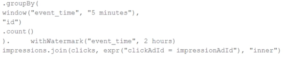

A data engineer wants to join a stream of advertisement impressions (when an ad was shown) with another stream of user clicks on advertisements to correlate when impressions led to monetizable clicks.In the code below, Impressions is a streaming DataFrame with a watermark ("event_time", "10 minutes")The data engineer notices the query slowing down significantly.Which solution would improve the performance?

- A.Joining on event time constraint: clickTime >= impressionTime AND clickTime <= impressionTime interval 1 hour
- B.Joining on event time constraint: clickTime + 3 hours < impressionTime - 2 hours
- C.Joining on event time constraint: clickTime == impressionTime using a leftOuter join
- D.Joining on event time constraint: clickTime >= impressionTime - interval 3 hours and removing watermarks

---

### Question 162

A junior data engineer has manually configured a series of jobs using the Databricks Jobs UI. Upon reviewing their work, the engineer realizes that they are listed as the "Owner" for each job. They attempt to transfer "Owner" privileges to the "DevOps" group, but cannot successfully accomplish this task.Which statement explains what is preventing this privilege transfer?

- A.Databricks jobs must have exactly one owner; "Owner" privileges cannot be assigned to a group.
- B.The creator of a Databricks job will always have "Owner" privileges; this configuration cannot be changed.
- C.Only workspace administrators can grant "Owner" privileges to a group.
- D.A user can only transfer job ownership to a group if they are also a member of that group.

---

### Question 163

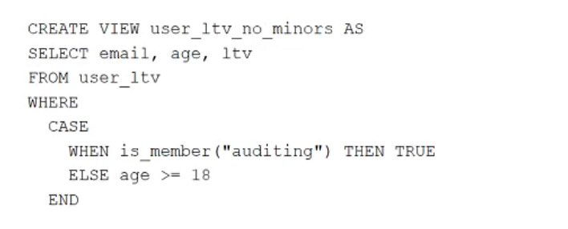

A table named user_ltv is being used to create a view that will be used by data analysts on various teams. Users in the workspace are configured into groups, which are used for setting up data access using ACLs.The user_ltv table has the following schema:email STRING, age INT, ltv INTThe following view definition is executed:An analyst who is not a member of the auditing group executes the following query:SELECT * FROM user_ltv_no_minorsWhich statement describes the results returned by this query?

- A.All columns will be displayed normally for those records that have an age greater than 17; records not meeting this condition will be omitted.
- B.All age values less than 18 will be returned as null values, all other columns will be returned with the values in user_ltv.
- C.All values for the age column will be returned as null values, all other columns will be returned with the values in user_ltv.
- D.All columns will be displayed normally for those records that have an age greater than 18; records not meeting this condition will be omitted.

---

### Question 164

All records from an Apache Kafka producer are being ingested into a single Delta Lake table with the following schema:key BINARY, value BINARY, topic STRING, partition LONG, offset LONG, timestamp LONGThere are 5 unique topics being ingested. Only the "registration" topic contains Personal Identifiable Information (PII). The company wishes to restrict access to PII. The company also wishes to only retain records containing PII in this table for 14 days after initial ingestion. However, for non-PII information, it would like to retain these records indefinitely.Which solution meets the requirements?

- A.All data should be deleted biweekly; Delta Lake's time travel functionality should be leveraged to maintain a history of non-PII information.
- B.Data should be partitioned by the registration field, allowing ACLs and delete statements to be set for the PII directory.
- C.Data should be partitioned by the topic field, allowing ACLs and delete statements to leverage partition boundaries.
- D.Separate object storage containers should be specified based on the partition field, allowing isolation at the storage level.

---

### Question 165

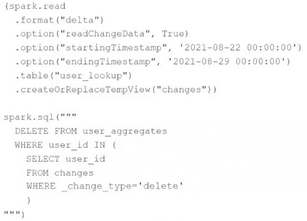

The data governance team is reviewing code used for deleting records for compliance with GDPR. The following logic has been implemented to propagate delete requests from the user_lookup table to the user_aggregates table.Assuming that user_id is a unique identifying key and that all users that have requested deletion have been removed from the user_lookup table, which statement describes whether successfully executing the above logic guarantees that the records to be deleted from the user_aggregates table are no longer accessible and why?

- A.No; the Delta Lake DELETE command only provides ACID guarantees when combined with the MERGE INTO command.
- B.No; files containing deleted records may still be accessible with time travel until a VACUUM command is used to remove invalidated data files.
- C.No; the change data feed only tracks inserts and updates, not deleted records.
- D.Yes; Delta Lake ACID guarantees provide assurance that the DELETE command succeeded fully and permanently purged these records.

---

### Question 166

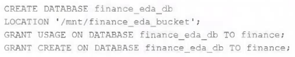

An external object storage container has been mounted to the location /mnt/finance_eda_bucket.The following logic was executed to create a database for the finance team:After the database was successfully created and permissions configured, a member of the finance team runs the following code:If all users on the finance team are members of the finance group, which statement describes how the tx_sales table will be created?

- A.A logical table will persist the query plan to the Hive Metastore in the Databricks control plane.
- B.An external table will be created in the storage container mounted to /mnt/finance_eda_bucket.
- C.A managed table will be created in the DBFS root storage container.
- D.An managed table will be created in the storage container mounted to /mnt/finance_eda_bucket.

---

### Question 167

A data engineer is designing a data pipeline. The source system generates files in a shared directory that is also used by other processes. As a result, the files should be kept as is and will accumulate in the directory. The data engineer needs to identify which files are new since the previous run in the pipeline, and set up the pipeline to only ingest those new files with each run.Which of the following tools can the data engineer use to solve this problem?

- A.Unity Catalog
- B.Delta Lake
- C.Databricks SQL
- D.Auto Loader

---

### Question 168

What is the retention of job run history?

- A.It is retained until you export or delete job run logs
- B.It is retained for 30 days, during which time you can deliver job run logs to DBFS or S3
- C.It is retained for 60 days, during which you can export notebook run results to HTML
- D.It is retained for 60 days, after which logs are archived

---

### Question 169

A data engineer, User A, has promoted a new pipeline to production by using the REST API to programmatically create several jobs. A DevOps engineer, User B, has configured an external orchestration tool to trigger job runs through the REST API. Both users authorized the REST API calls using their personal access tokens.Which statement describes the contents of the workspace audit logs concerning these events?

- A.Because the REST API was used for job creation and triggering runs, a Service Principal will be automatically used to identify these events.
- B.Because User A created the jobs, their identity will be associated with both the job creation events and the job run events.
- C.Because these events are managed separately, User A will have their identity associated with the job creation events and User B will have their identity associated with the job run events.
- D.Because the REST API was used for job creation and triggering runs, user identity will not be captured in the audit logs.

---

### Question 170

A distributed team of data analysts share computing resources on an interactive cluster with autoscaling configured. In order to better manage costs and query throughput, the workspace administrator is hoping to evaluate whether cluster upscaling is caused by many concurrent users or resource-intensive queries.In which location can one review the timeline for cluster resizing events?

- A.Workspace audit logs
- B.Driver's log file
- C.Ganglia
- D.Cluster Event Log

---

### Question 171

When evaluating the Ganglia Metrics for a given cluster with 3 executor nodes, which indicator would signal proper utilization of the VM's resources?

- A.The five Minute Load Average remains consistent/flat
- B.CPU Utilization is around 75%
- C.Network I/O never spikes
- D.Total Disk Space remains constant

---

### Question 172

The data engineer is using Spark's MEMORY_ONLY storage level.Which indicators should the data engineer look for in the Spark UI's Storage tab to signal that a cached table is not performing optimally?

- A.On Heap Memory Usage is within 75% of Off Heap Memory Usage
- B.The RDD Block Name includes the “*” annotation signaling a failure to cache
- C.Size on Disk is > 0
- D.The number of Cached Partitions > the number of Spark Partitions

---

### Question 173

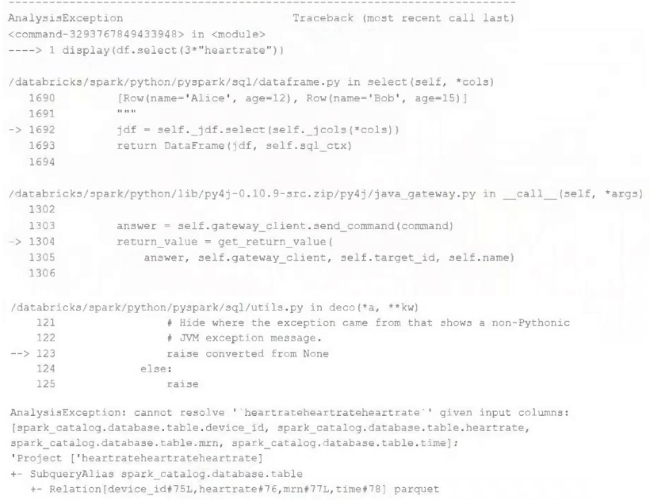

Review the following error traceback:Which statement describes the error being raised?

- A.There is a syntax error because the heartrate column is not correctly identified as a column.
- B.There is no column in the table named heartrateheartrateheartrate
- C.There is a type error because a column object cannot be multiplied.
- D.There is a type error because a DataFrame object cannot be multiplied.

---

### Question 174

What is a method of installing a Python package scoped at the notebook level to all nodes in the currently active cluster?

- A.Run source env/bin/activate in a notebook setup script
- B.Install libraries from PyPI using the cluster UI
- C.Use %pip install in a notebook cell
- D.Use %sh pip install in a notebook cell

---

### Question 175

A Databricks single-task workflow fails at the last task due to an error in a notebook. The data engineer fixes the mistake in the notebook.What should the data engineer do to rerun the workflow?

- A.Repair the task
- B.Rerun the pipeline
- C.Restart the cluster
- D.Switch the cluster

---

### Question 176

Incorporating unit tests into a PySpark application requires upfront attention to the design of your jobs, or a potentially significant refactoring of existing code.Which benefit offsets this additional effort?

- A.Improves the quality of your data
- B.Validates a complete use case of your application
- C.Troubleshooting is easier since all steps are isolated and tested individually
- D.Ensures that all steps interact correctly to achieve the desired end result

---

### Question 177

What describes integration testing?

- A.It validates an application use case.
- B.It validates behavior of individual elements of an application,
- C.It requires an automated testing framework.
- D.It validates interactions between subsystems of your application.

---

### Question 178

The Databricks CLI is used to trigger a run of an existing job by passing the job_id parameter. The response that the job run request has been submitted successfully includes a field run_id.Which statement describes what the number alongside this field represents?

- A.The job_id and number of times the job has been run are concatenated and returned.
- B.The globally unique ID of the newly triggered run.
- C.The number of times the job definition has been run in this workspace.
- D.The job_id is returned in this field.

---

### Question 179

A Databricks job has been configured with three tasks, each of which is a Databricks notebook. Task A does not depend on other tasks. Tasks B and C run in parallel, with each having a serial dependency on task A.What will be the resulting state if tasks A and B complete successfully but task C fails during a scheduled run?

- A.All logic expressed in the notebook associated with tasks A and B will have been successfully completed; some operations in task C may have completed successfully.
- B.Unless all tasks complete successfully, no changes will be committed to the Lakehouse; because task C failed, all commits will be rolled back automatically.
- C.Because all tasks are managed as a dependency graph, no changes will be committed to the Lakehouse until all tasks have successfully been completed.
- D.All logic expressed in the notebook associated with tasks A and B will have been successfully completed; any changes made in task C will be rolled back due to task failure.

---

### Question 180

When scheduling Structured Streaming jobs for production, which configuration automatically recovers from query failures and keeps costs low?

- A.Cluster: New Job Cluster;Retries: Unlimited;Maximum Concurrent Runs: 1
- B.Cluster: New Job Cluster;Retries: Unlimited;Maximum Concurrent Runs: Unlimited
- C.Cluster: Existing All-Purpose Cluster;Retries: Unlimited;Maximum Concurrent Runs: 1
- D.Cluster: New Job Cluster;Retries: None;Maximum Concurrent Runs: 1

---

### Question 181

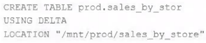

A Delta Lake table was created with the below query:Realizing that the original query had a typographical error, the below code was executed:ALTER TABLE prod.sales_by_stor RENAME TO prod.sales_by_storeWhich result will occur after running the second command?

- A.The table reference in the metastore is updated.
- B.All related files and metadata are dropped and recreated in a single ACID transaction.
- C.The table name change is recorded in the Delta transaction log.
- D.A new Delta transaction log is created for the renamed table.

---

### Question 182

The data engineering team has configured a Databricks SQL query and alert to monitor the values in a Delta Lake table. The recent_sensor_recordings table contains an identifying sensor_id alongside the timestamp and temperature for the most recent 5 minutes of recordings.The below query is used to create the alert:The query is set to refresh each minute and always completes in less than 10 seconds. The alert is set to trigger when mean (temperature) > 120. Notifications are triggered to be sent at most every 1 minute.If this alert raises notifications for 3 consecutive minutes and then stops, which statement must be true?

- A.The total average temperature across all sensors exceeded 120 on three consecutive executions of the query
- B.The average temperature recordings for at least one sensor exceeded 120 on three consecutive executions of the query
- C.The source query failed to update properly for three consecutive minutes and then restarted
- D.The maximum temperature recording for at least one sensor exceeded 120 on three consecutive executions of the query

---

### Question 183

A junior developer complains that the code in their notebook isn't producing the correct results in the development environment. A shared screenshot reveals that while they're using a notebook versioned with Databricks Repos, they're using a personal branch that contains old logic. The desired branch named dev-2.3.9 is not available from the branch selection dropdown.Which approach will allow this developer to review the current logic for this notebook?

- A.Use Repos to make a pull request use the Databricks REST API to update the current branch to dev-2.3.9
- B.Use Repos to pull changes from the remote Git repository and select the dev-2.3.9 branch.
- C.Use Repos to checkout the dev-2.3.9 branch and auto-resolve conflicts with the current branch
- D.Use Repos to merge the current branch and the dev-2.3.9 branch, then make a pull request to sync with the remote repository

---

### Question 184

Two of the most common data locations on Databricks are the DBFS root storage and external object storage mounted with dbutils.fs.mount().Which of the following statements is correct?

- A.DBFS is a file system protocol that allows users to interact with files stored in object storage using syntax and guarantees similar to Unix file systems.
- B.By default, both the DBFS root and mounted data sources are only accessible to workspace administrators.
- C.The DBFS root is the most secure location to store data, because mounted storage volumes must have full public read and write permissions.
- D.The DBFS root stores files in ephemeral block volumes attached to the driver, while mounted directories will always persist saved data to external storage between sessions.

---

### Question 185

An upstream system has been configured to pass the date for a given batch of data to the Databricks Jobs API as a parameter. The notebook to be scheduled will use this parameter to load data with the following code:df = spark.read.format("parquet").load(f"/mnt/source/(date)")Which code block should be used to create the date Python variable used in the above code block?

- A.date = spark.conf.get("date")
- B.import sysdate = sys.argv[1]
- C.date = dbutils.notebooks.getParam("date")
- D.dbutils.widgets.text("date", "null")date = dbutils.widgets.get("date")

---

### Question 186

The Databricks workspace administrator has configured interactive clusters for each of the data engineering groups. To control costs, clusters are set to terminate after 30 minutes of inactivity. Each user should be able to execute workloads against their assigned clusters at any time of the day.Assuming users have been added to a workspace but not granted any permissions, which of the following describes the minimal permissions a user would need to start and attach to an already configured cluster.

- A."Can Manage" privileges on the required cluster
- B.Cluster creation allowed, "Can Restart" privileges on the required cluster
- C.Cluster creation allowed, "Can Attach To" privileges on the required cluster
- D."Can Restart" privileges on the required cluster

---

### Question 187

The data science team has created and logged a production model using MLflow. The following code correctly imports and applies the production model to output the predictions as a new DataFrame named preds with the schema "customer_id LONG, predictions DOUBLE, date DATE".The data science team would like predictions saved to a Delta Lake table with the ability to compare all predictions across time. Churn predictions will be made at most once per day.Which code block accomplishes this task while minimizing potential compute costs?

- A.preds.write.mode("append").saveAsTable("churn_preds")
- B.preds.write.format("delta").save("/preds/churn_preds")
- C.
- D.

---

### Question 188

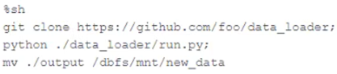

The following code has been migrated to a Databricks notebook from a legacy workload:The code executes successfully and provides the logically correct results, however, it takes over 20 minutes to extract and load around 1 GB of data.Which statement is a possible explanation for this behavior?

- A.%sh triggers a cluster restart to collect and install Git. Most of the latency is related to cluster startup time.
- B.Instead of cloning, the code should use %sh pip install so that the Python code can get executed in parallel across all nodes in a cluster.
- C.%sh does not distribute file moving operations; the final line of code should be updated to use %fs instead.
- D.%sh executes shell code on the driver node. The code does not take advantage of the worker nodes or Databricks optimized Spark.

---

### Question 189

A Delta table of weather records is partitioned by date and has the below schema:date DATE, device_id INT, temp FLOAT, latitude FLOAT, longitude FLOATTo find all the records from within the Arctic Circle, you execute a query with the below filter:latitude > 66.3Which statement describes how the Delta engine identifies which files to load?

- A.All records are cached to an operational database and then the filter is applied
- B.The Parquet file footers are scanned for min and max statistics for the latitude column
- C.The Hive metastore is scanned for min and max statistics for the latitude column
- D.The Delta log is scanned for min and max statistics for the latitude column

---

### Question 190

In order to prevent accidental commits to production data, a senior data engineer has instituted a policy that all development work will reference clones of Delta Lake tables. After testing both DEEP and SHALLOW CLONE, development tables are created using SHALLOW CLONE.A few weeks after initial table creation, the cloned versions of several tables implemented as Type 1 Slowly Changing Dimension (SCD) stop working. The transaction logs for the source tables show that VACUUM was run the day before.Which statement describes why the cloned tables are no longer working?

- A.Because Type 1 changes overwrite existing records, Delta Lake cannot guarantee data consistency for cloned tables.
- B.Running VACUUM automatically invalidates any shallow clones of a table; DEEP CLONE should always be used when a cloned table will be repeatedly queried.
- C.The data files compacted by VACUUM are not tracked by the cloned metadata; running REFRESH on the cloned table will pull in recent changes.
- D.The metadata created by the CLONE operation is referencing data files that were purged as invalid by the VACUUM command.

---

### Question 191

A junior data engineer has configured a workload that posts the following JSON to the Databricks REST API endpoint 2.0/jobs/create.Assuming that all configurations and referenced resources are available, which statement describes the result of executing this workload three times?

- A.The logic defined in the referenced notebook will be executed three times on the referenced existing all purpose cluster.
- B.The logic defined in the referenced notebook will be executed three times on new clusters with the configurations of the provided cluster ID.
- C.Three new jobs named "Ingest new data" will be defined in the workspace, but no jobs will be executed.
- D.One new job named "Ingest new data" will be defined in the workspace, but it will not be executed.

---

### Question 192

A Delta Lake table in the Lakehouse named customer_churn_params is used in churn prediction by the machine learning team. The table contains information about customers derived from a number of upstream sources. Currently, the data engineering team populates this table nightly by overwriting the table with the current valid values derived from upstream data sources.Immediately after each update succeeds, the data engineering team would like to determine the difference between the new version and the previous version of the table.Given the current implementation, which method can be used?

- A.Execute a query to calculate the difference between the new version and the previous version using Delta Lake’s built-in versioning and lime travel functionality.
- B.Parse the Delta Lake transaction log to identify all newly written data files.
- C.Parse the Spark event logs to identify those rows that were updated, inserted, or deleted.
- D.Execute DESCRIBE HISTORY customer_churn_params to obtain the full operation metrics for the update, including a log of all records that have been added or modified.

---

### Question 193

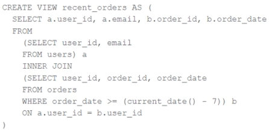

A view is registered with the following code:Both users and orders are Delta Lake tables.Which statement describes the results of querying recent_orders?

- A.The versions of each source table will be stored in the table transaction log; query results will be saved to DBFS with each query.
- B.All logic will execute when the table is defined and store the result of joining tables to the DBFS; this stored data will be returned when the table is queried.
- C.All logic will execute at query time and return the result of joining the valid versions of the source tables at the time the query finishes.
- D.All logic will execute at query time and return the result of joining the valid versions of the source tables at the time the query began.

---

### Question 194

A data engineer is performing a join operation to combine values from a static userLookup table with a streaming DataFrame streamingDF.Which code block attempts to perform an invalid stream-static join?

- A.userLookup.join(streamingDF, ["user_id"], how="right")
- B.streamingDF.join(userLookup, ["user_id"], how="inner")
- C.userLookup.join(streamingDF, ["user_id"), how="inner")
- D.userLookup.join(streamingDF, ["user_id"], how="left")

---

### Question 195

A junior data engineer has been asked to develop a streaming data pipeline with a grouped aggregation using DataFrame df. The pipeline needs to calculate the average humidity and average temperature for each non-overlapping five-minute interval. Incremental state information should be maintained for 10 minutes for late-arriving data.Streaming DataFrame df has the following schema:"device_id INT, event_time TIMESTAMP, temp FLOAT, humidity FLOAT"Code block:Choose the response that correctly fills in the blank within the code block to complete this task.

- A.withWatermark("event_time", "10 minutes")
- B.awaitArrival("event_time", "10 minutes")
- C.await("event_time + ‘10 minutes'")
- D.slidingWindow("event_time", "10 minutes")

---

### Question 196

A data architect has designed a system in which two Structured Streaming jobs will concurrently write to a single bronze Delta table. Each job is subscribing to a different topic from an Apache Kafka source, but they will write data with the same schema. To keep the directory structure simple, a data engineer has decided to nest a checkpoint directory to be shared by both streams.The proposed directory structure is displayed below:Which statement describes whether this checkpoint directory structure is valid for the given scenario and why?

- A.No; Delta Lake manages streaming checkpoints in the transaction log.
- B.Yes; both of the streams can share a single checkpoint directory.
- C.No; only one stream can write to a Delta Lake table.
- D.No; each of the streams needs to have its own checkpoint directory.

---

### Question 197

A Structured Streaming job deployed to production has been experiencing delays during peak hours of the day. At present, during normal execution, each microbatch of data is processed in less than 3 seconds. During peak hours of the day, execution time for each microbatch becomes very inconsistent, sometimes exceeding 30 seconds. The streaming write is currently configured with a trigger interval of 10 seconds.Holding all other variables constant and assuming records need to be processed in less than 10 seconds, which adjustment will meet the requirement?

- A.Decrease the trigger interval to 5 seconds; triggering batches more frequently allows idle executors to begin processing the next batch while longer running tasks from previous batches finish.
- B.Decrease the trigger interval to 5 seconds; triggering batches more frequently may prevent records from backing up and large batches from causing spill.
- C.The trigger interval cannot be modified without modifying the checkpoint directory; to maintain the current stream state, increase the number of shuffle partitions to maximize parallelism.
- D.Use the trigger once option and configure a Databricks job to execute the query every 10 seconds; this ensures all backlogged records are processed with each batch.

---

### Question 198

Which statement describes the default execution mode for Databricks Auto Loader?

- A.Cloud vendor-specific queue storage and notification services are configured to track newly arriving files; new files are incrementally and idempotently loaded into the target Delta Lake table.
- B.New files are identified by listing the input directory; the target table is materialized by directly querying all valid files in the source directory.
- C.Webhooks trigger a Databricks job to run anytime new data arrives in a source directory; new data are automatically merged into target tables using rules inferred from the data.
- D.New files are identified by listing the input directory; new files are incrementally and idempotently loaded into the target Delta Lake table.

---

### Question 199

Which statement describes the correct use of pyspark.sql.functions.broadcast?

- A.It marks a column as having low enough cardinality to properly map distinct values to available partitions, allowing a broadcast join.
- B.It marks a column as small enough to store in memory on all executors, allowing a broadcast join.
- C.It caches a copy of the indicated table on all nodes in the cluster for use in all future queries during the cluster lifetime.
- D.It marks a DataFrame as small enough to store in memory on all executors, allowing a broadcast join.

---

### Question 200

Spill occurs as a result of executing various wide transformations. However, diagnosing spill requires one to proactively look for key indicators.Where in the Spark UI are two of the primary indicators that a partition is spilling to disk?

- A.Stage’s detail screen and Query’s detail screen
- B.Stage’s detail screen and Executor’s log files
- C.Driver’s and Executor’s log files
- D.Executor’s detail screen and Executor’s log files

---

### Question 201

An upstream source writes Parquet data as hourly batches to directories named with the current date. A nightly batch job runs the following code to ingest all data from the previous day as indicated by the date variable:Assume that the fields customer_id and order_id serve as a composite key to uniquely identify each order.If the upstream system is known to occasionally produce duplicate entries for a single order hours apart, which statement is correct?

- A.Each write to the orders table will only contain unique records, and only those records without duplicates in the target table will be written.
- B.Each write to the orders table will only contain unique records, but newly written records may have duplicates already present in the target table.
- C.Each write to the orders table will only contain unique records; if existing records with the same key are present in the target table, these records will be overwritten.
- D.Each write to the orders table will run deduplication over the union of new and existing records, ensuring no duplicate records are present.

---

### Question 202

A junior data engineer on your team has implemented the following code block.The view new_events contains a batch of records with the same schema as the events Delta table. The event_id field serves as a unique key for this table.When this query is executed, what will happen with new records that have the same event_id as an existing record?

- A.They are merged.
- B.They are ignored.
- C.They are updated.
- D.They are inserted.

---

### Question 203

A new data engineer notices that a critical field was omitted from an application that writes its Kafka source to Delta Lake. This happened even though the critical field was in the Kafka source. That field was further missing from data written to dependent, long-term storage. The retention threshold on the Kafka service is seven days. The pipeline has been in production for three months.Which describes how Delta Lake can help to avoid data loss of this nature in the future?

- A.The Delta log and Structured Streaming checkpoints record the full history of the Kafka producer.
- B.Delta Lake schema evolution can retroactively calculate the correct value for newly added fields, as long as the data was in the original source.
- C.Delta Lake automatically checks that all fields present in the source data are included in the ingestion layer.
- D.Ingesting all raw data and metadata from Kafka to a bronze Delta table creates a permanent, replayable history of the data state.

---

### Question 204

The data engineering team maintains the following code:Assuming that this code produces logically correct results and the data in the source table has been de-duplicated and validated, which statement describes what will occur when this code is executed?

- A.The silver_customer_sales table will be overwritten by aggregated values calculated from all records in the gold_customer_lifetime_sales_summary table as a batch job.
- B.A batch job will update the gold_customer_lifetime_sales_summary table, replacing only those rows that have different values than the current version of the table, using customer_id as the primary key.
- C.The gold_customer_lifetime_sales_summary table will be overwritten by aggregated values calculated from all records in the silver_customer_sales table as a batch job.
- D.An incremental job will detect if new rows have been written to the silver_customer_sales table; if new rows are detected, all aggregates will be recalculated and used to overwrite the gold_customer_lifetime_sales_summary table.

---

### Question 205

The data engineering team is migrating an enterprise system with thousands of tables and views into the Lakehouse. They plan to implement the target architecture using a series of bronze, silver, and gold tables. Bronze tables will almost exclusively be used by production data engineering workloads, while silver tables will be used to support both data engineering and machine learning workloads. Gold tables will largely serve business intelligence and reporting purposes. While personal identifying information (PII) exists in all tiers of data, pseudonymization and anonymization rules are in place for all data at the silver and gold levels.The organization is interested in reducing security concerns while maximizing the ability to collaborate across diverse teams.Which statement exemplifies best practices for implementing this system?

- A.Isolating tables in separate databases based on data quality tiers allows for easy permissions management through database ACLs and allows physical separation of default storage locations for managed tables.
- B.Because databases on Databricks are merely a logical construct, choices around database organization do not impact security or discoverability in the Lakehouse.
- C.Storing all production tables in a single database provides a unified view of all data assets available throughout the Lakehouse, simplifying discoverability by granting all users view privileges on this database.
- D.Working in the default Databricks database provides the greatest security when working with managed tables, as these will be created in the DBFS root.

---

### Question 206

The data architect has mandated that all tables in the Lakehouse should be configured as external (also known as "unmanaged") Delta Lake tables.Which approach will ensure that this requirement is met?

- A.When a database is being created, make sure that the LOCATION keyword is used.
- B.When the workspace is being configured, make sure that external cloud object storage has been mounted.
- C.When data is saved to a table, make sure that a full file path is specified alongside the USING DELTA clause.
- D.When tables are created, make sure that the UNMANAGED keyword is used in the CREATE TABLE statement.

---

### Question 207

To reduce storage and compute costs, the data engineering team has been tasked with curating a series of aggregate tables leveraged by business intelligence dashboards, customer-facing applications, production machine learning models, and ad hoc analytical queries.The data engineering team has been made aware of new requirements from a customer-facing application, which is the only downstream workload they manage entirely. As a result, an aggregate table used by numerous teams across the organization will need to have a number of fields renamed, and additional fields will also be added.Which of the solutions addresses the situation while minimally interrupting other teams in the organization without increasing the number of tables that need to be managed?

- A.Send all users notice that the schema for the table will be changing; include in the communication the logic necessary to revert the new table schema to match historic queries.
- B.Configure a new table with all the requisite fields and new names and use this as the source for the customer-facing application; create a view that maintains the original data schema and table name by aliasing select fields from the new table.
- C.Create a new table with the required schema and new fields and use Delta Lake's deep clone functionality to sync up changes committed to one table to the corresponding table.
- D.Replace the current table definition with a logical view defined with the query logic currently writing the aggregate table; create a new table to power the customer-facing application.

---

### Question 208

A Delta Lake table representing metadata about content posts from users has the following schema:user_id LONG, post_text STRING, post_id STRING, longitude FLOAT, latitude FLOAT, post_time TIMESTAMP, date DATEBased on the above schema, which column is a good candidate for partitioning the Delta Table?

- A.post_time
- B.date
- C.post_id
- D.user_id

---

### Question 209

The downstream consumers of a Delta Lake table have been complaining about data quality issues impacting performance in their applications. Specifically, they have complained that invalid latitude and longitude values in the activity_details table have been breaking their ability to use other geolocation processes.A junior engineer has written the following code to add CHECK constraints to the Delta Lake table:A senior engineer has confirmed the above logic is correct and the valid ranges for latitude and longitude are provided, but the code fails when executed.Which statement explains the cause of this failure?

- A.The current table schema does not contain the field valid_coordinates; schema evolution will need to be enabled before altering the table to add a constraint.
- B.The activity_details table already exists; CHECK constraints can only be added during initial table creation.
- C.The activity_details table already contains records that violate the constraints; all existing data must pass CHECK constraints in order to add them to an existing table.
- D.The activity_details table already contains records; CHECK constraints can only be added prior to inserting values into a table.

---

### Question 210

What is true for Delta Lake?

- A.Views in the Lakehouse maintain a valid cache of the most recent versions of source tables at all times.
- B.Primary and foreign key constraints can be leveraged to ensure duplicate values are never entered into a dimension table.
- C.Delta Lake automatically collects statistics on the first 32 columns of each table which are leveraged in data skipping based on query filters.
- D.Z-order can only be applied to numeric values stored in Delta Lake tables.

---

### Question 211

The view updates represents an incremental batch of all newly ingested data to be inserted or updated in the customers table.The following logic is used to process these records.Which statement describes this implementation?

- A.The customers table is implemented as a Type 2 table; old values are overwritten and new customers are appended.
- B.The customers table is implemented as a Type 2 table; old values are maintained but marked as no longer current and new values are inserted.
- C.The customers table is implemented as a Type 0 table; all writes are append only with no changes to existing values.
- D.The customers table is implemented as a Type 1 table; old values are overwritten by new values and no history is maintained.

---

### Question 212

A team of data engineers are adding tables to a DLT pipeline that contain repetitive expectations for many of the same data quality checks. One member of the team suggests reusing these data quality rules across all tables defined for this pipeline.What approach would allow them to do this?

- A.Add data quality constraints to tables in this pipeline using an external job with access to pipeline configuration files.
- B.Use global Python variables to make expectations visible across DLT notebooks included in the same pipeline.
- C.Maintain data quality rules in a separate Databricks notebook that each DLT notebook or file can import as a library.
- D.Maintain data quality rules in a Delta table outside of this pipeline's target schema, providing the schema name as a pipeline parameter.

---

### Question 213

The DevOps team has configured a production workload as a collection of notebooks scheduled to run daily using the Jobs UI. A new data engineering hire is onboarding to the team and has requested access to one of these notebooks to review the production logic.What are the maximum notebook permissions that can be granted to the user without allowing accidental changes to production code or data?

- A.Can manage
- B.Can edit
- C.Can run
- D.Can read

---

### Question 214

A table named user_ltv is being used to create a view that will be used by data analysts on various teams. Users in the workspace are configured into groups, which are used for setting up data access using ACLs.The user_ltv table has the following schema:email STRING, age INT, ltv INTThe following view definition is executed:An analyst who is not a member of the marketing group executes the following query:SELECT * FROM email_ltv -Which statement describes the results returned by this query?

- A.Three columns will be returned, but one column will be named "REDACTED" and contain only null values.
- B.Only the email and ltv columns will be returned; the email column will contain all null values.
- C.The email and ltv columns will be returned with the values in user_ltv.
- D.Only the email and ltv columns will be returned; the email column will contain the string "REDACTED" in each row.

---

### Question 215

The data governance team has instituted a requirement that all tables containing Personal Identifiable Information (PII) must be clearly annotated. This includes adding column comments, table comments, and setting the custom table property "contains_pii" = true.The following SQL DDL statement is executed to create a new table:Which command allows manual confirmation that these three requirements have been met?

- A.DESCRIBE EXTENDED dev.pii_test
- B.DESCRIBE DETAIL dev.pii_test
- C.SHOW TBLPROPERTIES dev.pii_test
- D.DESCRIBE HISTORY dev.pii_test

---

### Question 216

The data governance team is reviewing code used for deleting records for compliance with GDPR. They note the following logic is used to delete records from the Delta Lake table named users.Assuming that user_id is a unique identifying key and that delete_requests contains all users that have requested deletion, which statement describes whether successfully executing the above logic guarantees that the records to be deleted are no longer accessible and why?

- A.Yes; Delta Lake ACID guarantees provide assurance that the DELETE command succeeded fully and permanently purged these records.
- B.No; files containing deleted records may still be accessible with time travel until a VACUUM command is used to remove invalidated data files.
- C.Yes; the Delta cache immediately updates to reflect the latest data files recorded to disk.
- D.No; the Delta Lake DELETE command only provides ACID guarantees when combined with the MERGE INTO command.

---

### Question 217

The data architect has decided that once data has been ingested from external sources into theDatabricks Lakehouse, table access controls will be leveraged to manage permissions for all production tables and views.The following logic was executed to grant privileges for interactive queries on a production database to the core engineering group.GRANT USAGE ON DATABASE prod TO eng;GRANT SELECT ON DATABASE prod TO eng;Assuming these are the only privileges that have been granted to the eng group and that these users are not workspace administrators, which statement describes their privileges?

- A.Group members are able to create, query, and modify all tables and views in the prod database, but cannot define custom functions.
- B.Group members are able to list all tables in the prod database but are not able to see the results of any queries on those tables.
- C.Group members are able to query and modify all tables and views in the prod database, but cannot create new tables or views.
- D.Group members are able to query all tables and views in the prod database, but cannot create or edit anything in the database.

---

### Question 218

A user wants to use DLT expectations to validate that a derived table report contains all records from the source, included in the table validation_copy.The user attempts and fails to accomplish this by adding an expectation to the report table definition.Which approach would allow using DLT expectations to validate all expected records are present in this table?

- A.Define a temporary table that performs a left outer join on validation_copy and report, and define an expectation that no report key values are null
- B.Define a SQL UDF that performs a left outer join on two tables, and check if this returns null values for report key values in a DLT expectation for the report table
- C.Define a view that performs a left outer join on validation_copy and report, and reference this view in DLT expectations for the report table
- D.Define a function that performs a left outer join on validation_copy and report, and check against the result in a DLT expectation for the report table

---

### Question 219

A user new to Databricks is trying to troubleshoot long execution times for some pipeline logic they are working on. Presently, the user is executing code cell-by-cell, using display() calls to confirm code is producing the logically correct results as new transformations are added to an operation. To get a measure of average time to execute, the user is running each cell multiple times interactively.Which of the following adjustments will get a more accurate measure of how code is likely to perform in production?

- A.The Jobs UI should be leveraged to occasionally run the notebook as a job and track execution time during incremental code development because Photon can only be enabled on clusters launched for scheduled jobs.
- B.The only way to meaningfully troubleshoot code execution times in development notebooks is to use production-sized data and production-sized clusters with Run All execution.
- C.Production code development should only be done using an IDE; executing code against a local build of open source Spark and Delta Lake will provide the most accurate benchmarks for how code will perform in production.
- D.Calling display() forces a job to trigger, while many transformations will only add to the logical query plan; because of caching, repeated execution of the same logic does not provide meaningful results.

---

### Question 220

Where in the Spark UI can one diagnose a performance problem induced by not leveraging predicate push-down?

- A.In the Executor’s log file, by grepping for "predicate push-down"
- B.In the Stage’s Detail screen, in the Completed Stages table, by noting the size of data read from the Input column
- C.In the Query Detail screen, by interpreting the Physical Plan
- D.In the Delta Lake transaction log. by noting the column statistics

---

### Question 221

A data engineer needs to capture pipeline settings from an existing setting in the workspace, and use them to create and version a JSON file to create a new pipeline.Which command should the data engineer enter in a web terminal configured with the Databricks CLI?

- A.Use list pipelines to get the specs for all pipelines; get the pipeline spec from the returned results; parse and use this to create a pipeline
- B.Stop the existing pipeline; use the returned settings in a reset command
- C.Use the get command to capture the settings for the existing pipeline; remove the pipeline_id and rename the pipeline; use this in a create command
- D.Use the clone command to create a copy of an existing pipeline; use the get JSON command to get the pipeline definition; save this to git

---

### Question 222

Which Python variable contains a list of directories to be searched when trying to locate required modules?

- A.importlib.resource_path
- B.sys.path
- C.os.path
- D.pypi.path

---

### Question 223

None

---

### Question 224

None

---

### Question 225

Which REST API call can be used to review the notebooks configured to run as tasks in a multi-task job?

- A./jobs/runs/list
- B./jobs/list
- C./jobs/runs/get
- D./jobs/get

---

### Question 226

A Data Engineer wants to run unit tests using common Python testing frameworks on Python functions defined across several Databricks notebooks currently used in production.How can the data engineer run unit tests against functions that work with data in production?

- A.Define and import unit test functions from a separate Databricks notebook
- B.Define and unit test functions using Files in Repos
- C.Run unit tests against non-production data that closely mirrors production
- D.Define unit tests and functions within the same notebook

---

### Question 227

A data engineer wants to refactor the following DLT code, which includes multiple table definitions with very similar code.In an attempt to programmatically create these tables using a parameterized table definition, the data engineer writes the following code.The pipeline runs an update with this refactored code, but generates a different DAG showing incorrect configuration values for these tables.How can the data engineer fix this?

- A.Wrap the for loop inside another table definition, using generalized names and properties to replace with those from the inner table definition.
- B.Convert the list of configuration values to a dictionary of table settings, using table names as keys.
- C.Move the table definition into a separate function, and make calls to this function using different input parameters inside the for loop.
- D.Load the configuration values for these tables from a separate file, located at a path provided by a pipeline parameter.

---

### Question 228

A data engineer has created a 'transactions' Delta table on Databricks that should be used by the analytics team. The analytics team wants to use the table with another tool which requires Apache Iceberg format.What should the data engineer do?

- A.Require the analytics team to use a tool which supports Delta table.
- B.Create an Iceberg copy of the 'transactions' Delta table which can be used by the analytics team.
- C.Convert the 'transactions' Delta to Iceberg and enable uniform so that the table can be read as a Delta table.
- D.Enable uniform on the transactions table to 'iceberg' so that the table can be read as an Iceberg table.

---

### Question 229

A junior data engineer is working to implement logic for a Lakehouse table named silver_device_recordings. The source data contains 100 unique fields in a highly nested JSON structure.The silver_device_recordings table will be used downstream for highly selective joins on a number of fields, and will also be leveraged by the machine learning team to filter on a handful of relevant fields. In total, 15 fields have been identified that will often be used for filter and join logic.The data engineer is trying to determine the best approach for dealing with these nested fields before declaring the table schema.Which of the following accurately presents information about Delta Lake and Databricks that may impact their decision-making process?

- A.Because Delta Lake uses Parquet for data storage, Dremel encoding information for nesting can be directly referenced by the Delta transaction log.
- B.Schema inference and evolution on Databricks ensure that inferred types will always accurately match the data types used by downstream systems.
- C.The Tungsten encoding used by Databricks is optimized for storing string data; newly-added native support for querying JSON strings means that string types are always most efficient.
- D.By default, Delta Lake collects statistics on the first 32 columns in a table; these statistics are leveraged for data skipping when executing selective queries.

---

### Question 230

A platform engineer is creating catalogs and schemas for the development team to use.The engineer has created an initial catalog, Catalog_A, and initial schema, Schema_A. The engineer has also granted USE CATALOG, USE SCHEMA, and CREATE TABLE to the development team so that the engineer can begin populating the schema with new tables.Despite being owner of the catalog and schema, the engineer noticed that they do not have access to the underlying tables in Schema_A.What explains the engineer's lack of access to the underlying tables?

- A.The owner of the schema does not automatically have permission to tables within the schema, but can grant them to themselves at any point.
- B.Users granted with USE CATALOG can modify the owner's permissions to downstream tables.
- C.Permissions explicitly given by the table creator are the only way the Platform Engineer could access the underlying tables in their schema.
- D.The platform engineer needs to execute a REFRESH statement as the table permissions did not automatically update for owners.

---

### Question 231

A data engineer has created a new cluster using shared access mode with default configurations. The data engineer needs to allow the development team access to view the driver logs if needed.What are the minimal cluster permissions that allow the development team to accomplish this?

- A.CAN VIEW
- B.CAN RESTART
- C.CAN ATTACH TO
- D.CAN MANAGE

---

### Question 232

A data engineer wants to create a cluster using the Databricks CLI for a big ETL pipeline. The cluster should have five workers and one driver of type i3.xlarge and should use the '14.3.x-scala2.12' runtime.Which command should the data engineer use?

- A.databricks compute add 14.3.x-scala2.12 --num-workers 5 --node-type-id i3.xlarge --cluster-name Data Engineer_cluster
- B.databricks clusters create 14.3.x-scala2.12 --num-workers 5 --node-type-id i3.xlarge --cluster-name Data Engineer_cluster
- C.databricks compute create 14.3.x-scala2.12 --num-workers 5 --node-type-id i3.xlarge --cluster-name Data Engineer_cluster
- D.databricks clusters add 14.3.x-scala2.12 --num-workers 5 --node-type-id i3.xlarge --cluster-name Data Engineer_cluster

---

### Question 233

A 'transactions' table has been liquid clustered on the columns 'product_id’, ’user_id' and 'event_date'.Which operation lacks support for cluster on write?

- A.CTAS and RTAS statements
- B.spark.writeStream.format(’delta').mode(’append’)
- C.spark.write.format('delta’).mode('append')
- D.INSERT INTO operations

---

### Question 234

The data governance team has instituted a requirement that the "user" table containing Personal Identifiable Information (PII) must have the appropriate masking on the SSN column. This means that anyone outside of the HRAdminGroup should see masked social security numbers as ***-**-****.The team created a masking function:What does the data governance team need to do next to achieve this goal?

- A.CREATE TABLE users -(name STRING);ALTER TABLE users CREATE COLUMN ssn CREATE MASK ssn_mask;
- B.CREATE TABLE users -(name STRING, int STRING);ALTER TABLE users ALTER COLUMN ssn CREATE MASK if is_member('HRAdminGroup');
- C.CREATE TABLE users -(name STRING, ssn INT MASKED ssn_mask);
- D.CREATE TABLE users -(name STRING, ssn STRING);ALTER TABLE users ALTER COLUMN ssn SET MASK ssn_mask;

---

### Question 235

A data engineer needs to create an application that will collect information about the latest job run including the repair history.How should the data engineer format the request?

- A.Call/api/2.1/jobs/runs/list with the run_id and include_history parameters
- B.Call/api/2.1/jobs/runs/get with the run_id and include_history parameters
- C.Call/api/2.1/jobs/runs/get with the job_id and include_history parameters
- D.Call/api/2.1/jobs/runs/list with the job_id and include_history parameters

---

### Question 236

A data engineer is working in an interactive notebook with many transformations before outputting the result from display(df.collect() ). The notebook includes wide transformations and a cross join.The data engineer is getting the following error: "The spark driver has stopped unexpectedly and is restarting. Your notebook will be automatically reattached."Which action should the data engineer take?

- A.Run the notebook on a single node cluster to keep driver from falling.
- B.Rewrite their code to avoid putting memory pressure on the driver node.
- C.Check into the Spark UI to see how many jobs are assigned to each stage as they are employing fewer executors.
- D.Look at the compute metrics UI to see if the executors have higher than 90% memory utilization.

---

### Question 237

An analytics team wants run an experiment in the short term on the customer transaction Delta table (with 20 billions records) created by the data engineering team in Databricks SQL.Which strategy should the data engineering team use to ensure minimal downtime and no impact on the ongoing ETL processes?

- A.Deep clone the table for the analytics team.
- B.Create a new table for the analytics team using a CTAS statement.
- C.Shallow clone the table for the analytics team.
- D.Give access to the table for the analytics team.

---

### Question 238

A data team is working to optimize an existing large, fast-growing table 'orders' with high cardinality columns, which experiences significant data skew and requires frequent concurrent writes. The team notice that the columns 'user_id', 'event_timestamp' and 'product_id' are heavily used in analytical queries and filters, although those keys may be subject to change in the future due to different business requirements.Which partitioning strategy should the team choose to optimize the table for immediate data skipping, incremental management over time, and flexibility?

- A.Partition the table with: ALTER TABLE orders PARTITION BY user_id, product_id, event_timestamp
- B.Use z-order after partitiing the table: OPTIMIZE orders ZORDER BY (user_id, product_id) WHERE event_timestamp = current date () - 1 DAY
- C.Cluster the table with: ALTER TABLE orders CLUSTER BY user_id, product_id, event_timestamp
- D.Z-order the table with OPTIMIZE orders ZORDER BY (user_id, product_id, event_timestamp)

---

